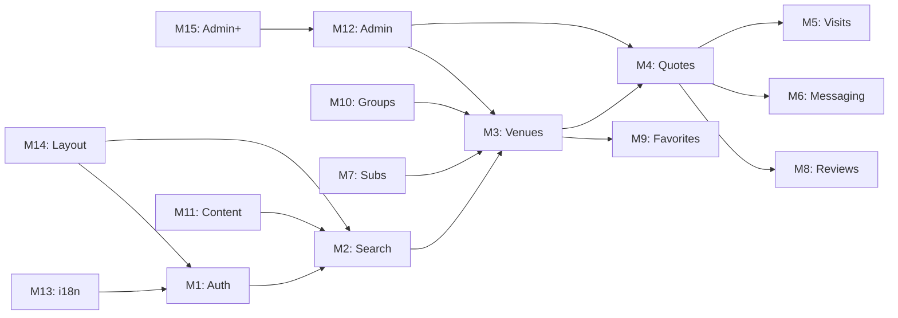

# PRD : Venues

> Product Requirements Document. Defines **what we are building** and **why**: product description, scope, user roles and **feature list**. This document stays in the problem and functional solution space: it does not prescribe technical choices (see [technical/architecture](../03-technical/architecture)).
>
> The detailed breakdown (stories, estimations) is in the [WBS](wbs). User journeys are in [ux/user-flows](../02-ux/user-flows).

## 1. Product description

Venues is a B2B marketplace for the MICE industry (Meetings, Incentives, Conferences, Exhibitions). It enables professional event organizers to discover, compare, and book venue spaces through an RFQ-based workflow. Partners (venue owners) manage their listings and respond to quote requests via a dedicated dashboard. The platform is monetized through partner subscription plans (Stripe).

### Product objectives

| Objective | Description |
|---|---|
| Enable venue discovery | Search with filters returns relevant results across venue types, destinations, capacities |
| Streamline quote process | End-to-end quote flow: request, response, accept/refuse |
| Build partner network | Self-service partner onboarding with venue listing management |
| Commercial platform | Platform supports marketing and advertising content from launch |
| Multilingual access | FR + EN supported at launch |
| Subscription monetization | Stripe-based recurring payments for partners |

## 2. Problem

### Observation

Professional event organizers (corporate planners, MICE agencies, seminar coordinators) search for venues across fragmented sources : word of mouth, outdated directories, direct phone calls. There is no centralized B2B platform for the MICE industry that combines venue discovery, comparison, RFQ-based quoting, and visit scheduling. Hotels and conference centers with modular spaces, professional AV equipment, and accommodation services lack a dedicated channel to reach qualified B2B leads.

### Impact

- Cross-referencing fragmented venue information is time-consuming
- Quoting process is slow and opaque (emails, phone calls, no tracking)
- Partners (venue owners) lack visibility and a direct channel to qualified leads
- No standardized way to compare venues on objective criteria

### Affected users

B2B event organizers (MICE agencies, corporate planners, seminar coordinators) and venue owners (hotels, conference centers, restaurants, atypical venues) across France. The platform is exclusively B2B : it does not target individual consumers or leisure bookings.

## 3. User roles

Roles are defined in the application code. Each role determines access to specific platform areas and actions.

| Role | Sub-type | Description | Key permissions |
|---|---|---|---|
| CLIENT | COMPANY | Corporate event planner (in-house) | Search venues, request quotes, schedule visits, leave reviews, manage favorites, access messaging |
| CLIENT | EVENT_AGENCY | MICE agency planner | Same as COMPANY. Typically handles higher volume of quote requests |
| CLIENT | ASSOCIATION | Non-profit or association organizer | Same as COMPANY |
| PARTNER | (none) | Venue owner or manager | Create and manage venue listings, respond to quotes, manage visits, access messaging, manage subscription |
| SUPER_ADMIN | (none) | Platform administrator | Full access: user management, venue moderation, content management, subscriptions oversight, analytics dashboard |

> Note : CLIENT sub-types share the same permissions. The distinction is used for segmentation and analytics, not access control.

## 4. Scope

All features below are part of the unified V1 delivery, targeting end of September 2026. The scope is split internally into a **Core** group (modules M1-M14) and an **Admin Advanced** group (module M15), both delivered within the same engagement.

### Core scope (M1-M14)

1. User authentication (email, Google SSO, LinkedIn SSO)
2. Venue search with advanced filters (type, destination, lifestyle, capacity, positioning)
3. Venue detail pages with images, descriptions, availability
4. Venue comparison (side-by-side)
5. Express quote request (single venue)
6. Multi-venue quote request
7. Quote response and acceptance flow
8. Visit scheduling (in-person + video via Twilio)
9. Client dashboard (quotes, visits, favorites, reviews, messaging)
10. Partner dashboard (venues, quotes, visits, reviews, messaging)
11. Partner subscription management (Stripe integration)
12. Real-time messaging (client to partner, Socket.io)
13. Reviews and ratings (post-quote validation)
14. Groups and independent partner pages
15. Blog / Le Mag (Strapi CMS)
16. Static pages (About, FAQ, Glossary, Labels, Manifesto, Legal)
17. Admin: user management, venue management, content moderation, dashboard with key metrics
18. Admin RBAC with 6 roles (Super Admin, Moderateur, Support client, Dev, Marketing, Commercial)
19. Admin messaging (admin-to-partner, admin-to-client, support requests)
20. Admin payment management (payment history, invoices, Stripe sync, promo codes)
21. Price catalog per venue (partner-managed, articles, unit prices, TVA)
22. Quote drafts (save and resume)
23. Quote per-day article selection (7 categories)
24. Invoice generation (partner sends invoice post-quote-validation)
25. File attachments in messaging
26. Venue limit configuration (admin-configurable 5-venue cap)
27. Venue preview mode (admin)
28. Subscription cancellation reason tracking
29. i18n (FR/EN)
30. Responsive design (desktop + mobile)
31. Newsletter (Brevo signup)
32. Axeptio cookie consent management
33. Action history / audit log

### Admin Advanced scope (M15)

Advanced admin features delivered within the same engagement, sequenced after the core scope.

1. A/B testing framework (F15.2)
2. Advanced admin analytics: visio/demo stats per admin, engagement metrics, revenue trends (F15.1)
3. ODOO integration (F15.6)
4. Advanced SEO: Google Search Console scoring, breadcrumbs (F15.6)
5. Automated subscription reminders and failed payment relance (F15.3)
6. Notification system: email templates, campaign scheduling, delivery metrics (F15.4)
7. Translation management UI (F15.8)
8. Content moderation: review approval/rejection, auto-flagging, moderation history (F15.5)
9. Advanced reporting module and export (F15.8)
10. Media buying management and venue credits (F12.12, refinement in F15.8)
11. Donation management UI: CAP VERS L'AVENIR integration (F15.8)
12. Graphic/design management: typography, icons (F15.16)
13. Tidio or equivalent live chat integration (F15.6)
14. Sandbox mode for testing admin changes (F15.9)
15. Beta feature access and progressive rollout (F15.10)
16. Feedback widget for user feedback collection (F15.11)
17. Email tracking: open/click rates (F15.12)
18. Newsletter full management via Brevo: templates, lists, campaigns, automation (F15.13)
19. Global media management with compression and Remove.bg config (F15.14)
20. Admin documentation (Loom) and partner moderation guidelines (F15.15)
21. Support tickets and feedback tracking (F15.17)
22. CRM notes: internal notes per client (F15.18)
23. Media buying and venue credits management (F15.19)
24. Login activity tracking and security event logging (F15.20)
25. Data export: CSV, analytics reports, GDPR export/deletion (F15.21)

> These items correspond to M15 in the WBS (52 JH). See [WBS](wbs) for the full breakdown. Change requests (CRs) cover items outside the contracted scope above; they are billed separately.

### WBS audit note

Several items from the original client WBS have been reviewed and categorized during this audit. All features — Core (M1-M14) and Admin Advanced (M15) — are part of the contracted scope and will be delivered within the unified engagement.

### Assumptions

- Client team (Charlotte Vaz, Léa Simon) validates Figma designs before development
- Partner onboarding content is provided by the commercial team
- Stripe account and configuration are handled by the client
- Twilio credentials are provided for video visit integration
- Strapi CMS is set up and maintained alongside the main platform

> The detailed scope decision log is in [product/scope](scope).

## 5. Feature list

> Overview of product features, organized by application module. Each feature is described from the user's perspective (what, not how). The breakdown into stories is in the [WBS](wbs).

### Overview

### Module 1 : Auth

Registration, login and user account management for clients, partners, and admins.

| Ref | Feature | Description | Priority |
|---|---|---|---|
| F1.1 | Email signup | Registration by email for clients and partners | P0 |
| F1.2 | Google SSO | Login and registration via Google | P0 |
| F1.3 | LinkedIn SSO | Login and registration via LinkedIn | P0 |
| F1.4 | Email verification | Account activation via email link | P0 |
| F1.5 | Password reset (OTP) | Reset via one-time code sent by email | P0 |
| F1.6 | SIRET prefill | Company information auto-fill from SIRET number (partner registration) | P1 |
| F1.7 | Two-factor authentication | 2FA via authenticator app for admin accounts (QR code setup, backup codes) | P1 |

### Module 2 : Search

Venue discovery with filtering, sorting, and comparison tools.

| Ref | Feature | Description | Priority |
|---|---|---|---|
| F2.1 | Venue search | Search with text query and location | P0 |
| F2.2 | Advanced filters | Filter by type, destination, lifestyle, capacity, positioning, services | P0 |
| F2.3 | Saved searches | Save and replay search criteria | P1 |
| F2.4 | Venue comparison | Side-by-side comparison of selected venues | P1 |

### Module 3 : Venues

Venue listing, detail pages, and partner management.

| Ref | Feature | Description | Priority |
|---|---|---|---|
| F3.1 | Venue listing | Browse venues with preview cards (image, name, capacity, location) | P0 |
| F3.2 | Venue detail | Full page: images, description, capacity, services, positioning, availability | P0 |
| F3.3 | Venue creation | Partner creates and publishes a venue listing | P0 |
| F3.4 | Venue management | Partner edits, pauses, or deletes a venue | P0 |
| F3.5 | Featured venues | Highlighted venues on homepage | P1 |
| F3.6 | Venue limit configuration | Admin can configure the 5-venue limit per partner (global or per-partner) | P1 |
| F3.7 | Venue preview mode | Admin previews a venue page before publication | P1 |
| F3.8 | Price catalog | Partner maintains a price catalog per venue (articles by category, unit prices, TVA, payment conditions, CGV/annexes). Catalog items auto-populate quote responses | P1 |

### Module 4 : Quotes

Quote request, response, and acceptance workflow.

| Ref | Feature | Description | Priority |
|---|---|---|---|
| F4.1 | Express quote | Client requests a quote from a single venue | P0 |
| F4.2 | Multi-venue quote | Client sends the same quote request to multiple venues | P0 |
| F4.3 | Quote response | Partner responds with availability and details | P0 |
| F4.4 | Quote acceptance | Client accepts or refuses a quote | P0 |
| F4.5 | Quote PDF | Generate a PDF summary of a quote | P1 |
| F4.6 | Quote draft | Save a quote request as draft (brouillon) and resume later | P1 |
| F4.7 | Quote per-day articles | Per-day article selection in quote form (quantities, schedules, descriptions across 7 categories: hebergement, location espaces, technique, restauration, services, ressources, divers) | P1 |
| F4.8 | Invoice generation | Partner generates and sends invoice via messaging after quote validation | P1 |

### Module 5 : Visits

Visit scheduling for in-person and video visits.

| Ref | Feature | Description | Priority |
|---|---|---|---|
| F5.1 | Visit scheduling | Client requests an in-person visit at the venue | P0 |
| F5.2 | Video visit | Schedule and conduct a video visit via Twilio | P1 |
| F5.3 | Visit management | Confirmation, cancellation, and rescheduling of visits | P1 |

### Module 6 : Messaging

Real-time communication between clients and partners.

| Ref | Feature | Description | Priority |
|---|---|---|---|
| F6.1 | Real-time chat | Socket.io-based messaging between client and partner | P0 |
| F6.2 | Messaging management | Conversation list and notifications | P0 |
| F6.3 | File attachments | Send and receive file attachments in conversations | P1 |
| F6.4 | Message archiving | Archive and flag/report conversations | P1 |
| F6.5 | Notification history in chat | In-chat notifications for quote status changes, visit updates, and devis events | P1 |

### Module 7 : Subscriptions & Payments

Partner subscription plans and payment via Stripe.

| Ref | Feature | Description | Priority |
|---|---|---|---|
| F7.1 | Plans display | Show available subscription plans | P0 |
| F7.2 | Stripe payment | Recurring payment integration via Stripe | P0 |
| F7.3 | Subscription management | Upgrade, downgrade, and cancellation flows | P1 |
| F7.4 | Pioneer plan | Lifetime subscription for early adopters | P1 |
| F7.5 | Promo codes | Admin creates and manages promotional codes and discounts | P1 |
| F7.6 | Invoice download | Partner downloads monthly invoices from subscription management | P1 |
| F7.7 | Cancellation tracking | Track and display subscription cancellation reasons | P1 |

### Module 8 : Reviews & Ratings

Post-quote review and rating system.

| Ref | Feature | Description | Priority |
|---|---|---|---|
| F8.1 | Review submission | Client submits a review after quote validation | P1 |
| F8.2 | Review display | Reviews shown on venue and partner pages | P1 |
| F8.3 | My reviews | Personal review management | P1 |

### Module 9 : Favorites

Saving and organizing preferred venues.

| Ref | Feature | Description | Priority |
|---|---|---|---|
| F9.1 | Venue favorites | Bookmark a venue from listing or detail page | P1 |
| F9.2 | Partner favorites | Bookmark preferred partners | P2 |

### Module 10 : Groups & Partners

Partner directory, group management, and ethical commitments.

| Ref | Feature | Description | Priority |
|---|---|---|---|
| F10.1 | Partner directory | Browse and view partner profiles | P1 |
| F10.2 | Groups | Group directory and group detail pages (hotel chain, venue network) | P1 |
| F10.3 | Ethical commitments | Display of environmental and ethical commitments | P1 |

### Module 11 : Content / CMS

Blog, static pages, and editorial content.

| Ref | Feature | Description | Priority |
|---|---|---|---|
| F11.1 | Blog / Le Mag | Articles managed via Strapi CMS | P1 |
| F11.2 | FAQ | Frequently asked questions page | P1 |
| F11.3 | Static pages | About, Glossary, Labels, Manifesto, Legal | P1 |
| F11.4 | Custom project | Custom event project submission form | P1 |

### Module 12 : Admin (Core)

Core platform administration interface.

| Ref | Feature | Description | Priority |
|---|---|---|---|
| F12.1 | Client management | CRUD for client accounts, access to per-client statistics, quotes, visits, reviews, and messaging history | P0 |
| F12.2 | Partner management | CRUD for partner accounts, access to per-partner statistics, venues, quotes, visits, reviews, and messaging history | P0 |
| F12.3 | Venue management | Review, edit, moderate venue listings. Highlights (mise en avant), preview mode, bulk actions (status change, delete) | P0 |
| F12.4 | Content management | Manage blog posts, FAQ, labels, taxonomy (labels, positionnement, type evenement, lifestyle, ambiance, equipements, services, valeurs, motifs refus/annulation devis) | P1 |
| F12.5 | Group management | Admin tools for group approval (Approuve, En attente, Refuse table), editing, auto-notification on modification | P1 |
| F12.6 | Dashboard | Key metrics: registered partners, registered clients, site visitors, revenue by subscription category, subscription statuses (active, expired, pending), quote/visit KPIs, review counts, favorites counts. Filterable by period. | P1 |
| F12.7 | RBAC (6 roles) | Multi-admin with role-based access: Super Admin, Moderateur, Support client, Dev, Marketing Communication, Equipe Commerciale. Section-level access restriction. | P0 |
| F12.8 | Admin messaging | Admin-to-partner and admin-to-client messaging interface. Support request reception and response. Instant discussion with form sending. | P1 |
| F12.11 | Payment management | View payment history and invoices. Handle payment disputes. Sync Stripe data with subscriptions. Subscription plan creation (mensuel, annuel, freemium). | P1 |

### Module 13 : i18n & Localization

Internationalization and language support.

| Ref | Feature | Description | Priority |
|---|---|---|---|
| F13.1 | Translation framework | i18n setup for frontend and admin applications | P0 |
| F13.2 | Content translation | Translation files and language switcher | P0 |

### Module 14 : Navigation & Layout

Global header, footer, and responsive layout.

| Ref | Feature | Description | Priority |
|---|---|---|---|
| F14.1 | Header | Global header for all authentication states | P0 |
| F14.2 | Footer | Global footer with links and newsletter | P0 |
| F14.3 | Layout | Responsive layout and auth-specific pages | P0 |
| F14.4 | "Devenir partenaire" landing page | Dedicated partner conversion page with value proposition, testimonials, and CTA | P1 |
| F14.5 | Legal pages management | Mentions legales, CGU/CGV, Privacy policy (structured pages, not just static text) | P1 |
| F14.6 | Calendly integration | Demo booking buttons on About, Become Partner, and Custom Project pages | P2 |
| F14.7 | Remove.bg API integration | Automatic background removal for profile and venue photos | P2 |

### Module 15 : Admin (Advanced)

Advanced admin features delivered within the unified engagement, sequenced after the Core modules.

| Ref | Feature | Description | Priority |
|---|---|---|---|
| F15.1 | Statistics | Advanced analytics dashboards: visio/demo stats per admin user, engagement metrics by period, revenue trends, site performance | P2 |
| F15.2 | A/B testing | A/B test configuration and result tracking on admin functionalities | P2 |
| F15.3 | Advanced subscription management | Subscription plan editing, automated renewal reminders, auto-relance for failed payments and inactive accounts | P2 |
| F15.4 | Notification system | Email templates and notification trigger configuration. Schedule and preview notification campaigns. Monitor delivery and engagement metrics (open, click, bounce rates). | P2 |
| F15.5 | Content moderation | Review and approve user-generated content. Flag and remove inappropriate material. Track moderation history. Auto-flagging rules. Review/testimony approval, editing, pinning, categorization. | P2 |
| F15.6 | Integrations | ODOO, Advanced SEO (Google Search Console scoring, breadcrumbs), Tidio or equivalent live chat, Axeptio cookie management | P2 |
| F15.7 | Infrastructure admin | Backup UI, maintenance mode, error pages (404/500), audit log | P2 |
| F15.8 | Advanced features | Translation UI, donation management (CAP VERS L'AVENIR), advanced reports export | P2 |
| F15.9 | Sandbox mode | Test subscription formulas and admin changes without impacting production | P2 |
| F15.10 | Beta feature access | Feature flags for progressive rollout of new functionality | P2 |
| F15.11 | Feedback widget | Embedded widget for user feedback collection (avis, suggestions, bugs) | P2 |
| F15.12 | Email tracking | Track email open and click rates for transactional and campaign emails | P2 |
| F15.13 | Newsletter management (Brevo) | Full newsletter management: build and edit templates, manage subscriber lists, blacklists, send campaigns, subscription/unsubscription stats, automation | P2 |
| F15.14 | Global media management | Admin management of site photos and videos with compression tools, Remove.bg API configuration (fond de couleur) | P2 |
| F15.15 | Admin documentation | Internal admin documentation (Loom videos), partner moderation guidelines | P2 |
| F15.16 | Graphic management | Admin tools for typography, icons, and visual identity management | P2 |
| F15.17 | Support tickets | View and respond to support tickets. Track user feedback (avis, suggestions, bugs). Statistics on support messages, chat, forms, demo requests | P2 |
| F15.18 | CRM notes | Internal notes and CRM history per client (not external CRM integration) | P2 |
| F15.19 | Media buying | Media and advertising purchase management. Media offer configuration. Venue credits system (offres achat and medias) | P2 |
| F15.20 | Login activity tracking | Track admin login sessions, security event logging, alert on suspicious connections | P2 |
| F15.21 | Data export | Export client/partner data as CSV. Export analytics reports. GDPR data export and deletion | P2 |

## 6. Implementation status (code audit, March 2026)

> Audit of active branches across all four repositories (`develop` for backend and frontend, `dev` for admin and strapi). This section serves as basis for Jira backlog alignment.
>
> Note : the backend was migrated from Express + MongoDB to NestJS + PostgreSQL + TypeORM in August 2025 (see [architecture ADR-006](../03-technical/architecture)). The legacy Express codebase remains on the `dev` branch but is no longer active.

### Status by module and codebase

| Module | Frontend (Next.js) | Backend (NestJS) | Admin (React+Vite) | CMS (Strapi) |
|---|---|---|---|---|
| M1: Auth | Done (email, Google SSO, LinkedIn SSO, password reset, OTP) | Done (email auth, Google SSO, LinkedIn OAuth, JWT via Passport, OTP, email verification) | Done (admin login, profile, RBAC with 6 roles) | - |
| M2: Search | Done (search bar, filters, comparison, saved searches, map) | Done (Elasticsearch integration, intelligent search, venue sync, search history) | - | - |
| M3: Venues | Done (listing, detail, creation, management, media, preview) | Done (VenueEntity full CRUD, bulk ops, duplicate, ES sync, 5-venue limit) | Done (full CRUD, history, statistics, preview) | - |
| M4: Quotes/RFQ | Done (express, multi-venue, response, acceptance, PDF) | Done (ProjectEntity full CRUD, multi-project, status flow, partner response) | Done (CRUD, status tracking) | - |
| M5: Visits | Done (scheduling, Twilio video, calendar integration) | Done (ScheduleVisitEntity full CRUD, Twilio video module, ticket system) | Done (list, details, status management) | - |
| M6: Messaging | Done (Socket.io chat, rooms, unread counts, notifications) | Done (MessageEntity, ChatRoomEntity, ChatRoomUserEntity, REST + Socket.io) | Done (chat rooms, messages, Socket.io) | - |
| M7: Subscriptions | Done (plans display, subscription management UI) | Done (PartnerSubscriptionEntity, SubscriptionPlanEntity, Stripe 18.5.0, checkout sessions, webhooks) | Done (Stripe config, subscription plans, promo codes, invoicing) | - |
| M8: Reviews | Done (submission, display, ratings, partner replies) | Done (VenueReviewEntity, UserReviewEntity, ReportEntity, ReportOptionEntity) | Partial (report config, no moderation UI) | - |
| M9: Favorites | Done (venues + partners, categories, lists) | Done (FavoriteVenueEntity, FavoritePartnerEntity, category entities) | - | - |
| M10: Groups | Done (search, directory, detail, partner sheets) | Done (GroupEntity full CRUD, admin approval flow) | Done (full CRUD, approval workflow, statistics) | - |
| M11: Content | Done (Strapi blog, FAQ, static pages, custom project) | Done (blog posts, MICE glossary, config endpoints) | Done (blogs disabled in routes but code exists, 16 config pages) | Done (Blog, Author, Category + 17 components, i18n, S3) |
| M12: Admin Core | - | Done (25+ admin routes, full CRUD all entities, 15+ config entities) | Done (users, partners, venues, groups, action history, backup, maintenance) | - |
| M13: i18n | Done (next-intl, FR/EN, 5000+ keys, locale routing) | Done (TranslationsEntity, TranslationTasksEntity) | Done (use-intl, translations management, task assignment) | Done (fr/en locales) |
| M14: Navigation | Done (header, footer, responsive, auth layouts) | - | Done (dashboard, sidebar, role-based navigation) | - |
| M15: Admin Adv. | - | Partial (backup, action history done; advanced stats, notification config pending) | Partial (action history, stats, highlights, email subs, backup, maintenance. Missing: review moderation UI, advanced notification config) | - |

### Backend architecture summary

The backend (`back/`, `develop` branch) is a NestJS 11 application with TypeORM on PostgreSQL. Key metrics :

| Metric | Value |
|---|---|
| Framework | NestJS 11.0.1 (TypeScript) |
| Database | PostgreSQL 16 (TypeORM 0.3.25) |
| Total entities | 66 |
| API route prefixes | 50+ (client + admin) |
| Third-party SDKs | Stripe 18.5.0, Twilio 5.10.1, Elasticsearch 8.15.0 |
| Real-time | Socket.io 4.8.1 via @nestjs/platform-socket.io |
| API docs | Swagger via @nestjs/swagger 11.2.0 |

Entity breakdown by domain :

| Domain | Entities | Key models |
|---|---|---|
| Core | 8 | User, VenueEntity, ProjectEntity, GroupEntity, ScheduleVisitEntity, TicketEntity, NotificationEntity, MediaEntity |
| Reviews | 4 | VenueReviewEntity, UserReviewEntity, ReportEntity, ReportOptionEntity |
| Messaging | 4 | MessageEntity, ChatRoomEntity, ChatRoomUserEntity, ContactEntity |
| Subscriptions | 4 | PartnerSubscriptionEntity, PartnerSubscriptionHistoryEntity, SubscriptionPlanEntity, StripeAccountConfigEntity |
| Configuration | 17 | VenueConfigEntity, UserConfigEntity, CommonConfigEntity, FaqConfigEntity, HomepageConfigEntity, and 12 others |
| Content | 7 | BlogPostEntity, BlogCategoryEntity, BlogTagEntity, MiceGlossaryEntity, TranslationsEntity, TranslationTasksEntity, HighlightVenueEntity |
| Favorites | 4 | FavoriteVenueEntity, FavoriteVenueCategoryEntity, FavoritePartnerEntity, FavoritePartnerCategoryEntity |
| History/Audit | 8 | UserHistoryEntity, VenueHistoryEntity, ProjectHistoryEntity, ScheduleVisitHistoryEntity, ActionHistoryEntity, and 3 others |
| Search | 1 | SearchVenueHistoryEntity |
| Admin | 5 | AdminEntity, AdminLoginAttemptsEntity, AdminReportEntity, BackupSchedulesEntity, BackupJobEntity |
| Other | 4 | EmailSubscriptionEntity, CustomProjectRequestEntity, UserVerifyEntity, UserNoteEntity |

### Remaining work

Features with partial or missing implementation :

| Area | Status | Remaining work |
|---|---|---|
| Axeptio cookie consent | Not implemented (any repo) | Integration needed (RGPD requirement, in scope) |
| Review moderation (admin UI) | Backend done, admin UI missing | Admin moderation interface for reviews |
| Blog admin routes | Code exists, routes disabled | Re-enable blog CRUD routes in admin |
| Advanced admin stats | Backend partial, admin partial | Unified revenue dashboard, advanced analytics |
| Brevo newsletter SDK | EmailSubscription entity exists, no Brevo SDK | Brevo API integration for newsletter automation |
| Notification configuration | Backend entity exists, admin UI partial | Notification template management |

### Jira epic mapping

| Module | VEN epics | VA epics | Status |
|---|---|---|---|
| M1: Auth | VEN-2 | VA-1 | Covered |
| M2: Search | VEN-63 | - | Covered (Elasticsearch integrated) |
| M3: Venues | VEN-4 | VA-6 | Covered |
| M4: Quotes/RFQ | VEN epics needed | VA epics needed | Backend + Frontend done, Jira mapping incomplete |
| M5: Visits | VEN epics needed | VA epics needed | Backend + Frontend done, Jira mapping incomplete |
| M6: Messaging | - | VA-17 | Covered |
| M7: Subscriptions | - | VA-8 + VA-9 | Covered (Stripe integrated) |
| M8: Reviews | - | VA-5 | Backend done, admin moderation UI pending |
| M9: Favorites | VEN epic needed | - | Backend + Frontend done, Jira mapping incomplete |
| M10: Groups | VEN-6 | VA-4 | Covered |
| M11: Content | VEN-3 | VA-12 | Covered |
| M12: Admin Core | VEN-58 | VA-2, VA-3, VA-14, VA-19 | Covered |
| M13: i18n | - | VA-11 | Covered |
| M14: Navigation | VEN-1, VEN-7 | - | Covered |
| M15: Admin Adv. | VEN-60 | VA-7, VA-10, VA-13, VA-16, VA-98 | Partial (Admin Advanced scope items) |

## 7. Functional grouping

> Internal grouping of features for sequencing and estimation. All groups are delivered in the unified V1 engagement. Detailed schedule in [planning/phases](../04-delivery/phases).

| Group | Modules | Objective | Charge (JH) |
|---|---|---|---|
| Core | M1-M14 | Full marketplace : auth, search, quotes, visits, messaging, subscriptions, admin core, layout, Axeptio, audit log | 319 |
| Admin Advanced | M15 | Advanced admin, A/B testing, ODOO, SEO, automation, backup UI, maintenance mode | 52 |
| **Total** | **M1-M15** | **Full contracted scope** | **371** |

> Items outside this scope require a separate change request (CR).

## 8. Constraints

- **Regulatory**: RGPD compliance, CGU/CGV required at launch
- **Organizational**: client wants to start advertising immediately upon launch
- **Technical**: 4 separate repositories to maintain (frontend, backend, admin, CMS)
- **Integration**: Stripe integration required for monetization, Twilio for video visits
- **Design**: client modifies Figma independently, requiring synchronization protocol

## 9. Risk register

| ID | Risk | Impact | Mitigation |
|---|---|---|---|
| R1 | Payment integration complexity (Stripe) | High | Dedicated developer, early sprint prioritization, test mode from day 1 |
| R2 | Design changes during development | Medium | Validated Figma copy as reference, changes go through PM |
| R3 | Multi-repository coordination | Medium | Shared conventions, CI/CD pipelines, documented architecture |
| R4 | Staging environment stability | Medium | Staging always 1 sprint behind dev, QC-validated only |
| R5 | Third-party dependency delays (Twilio, Stripe) | Medium | Early integration POCs, fallback strategies documented |
