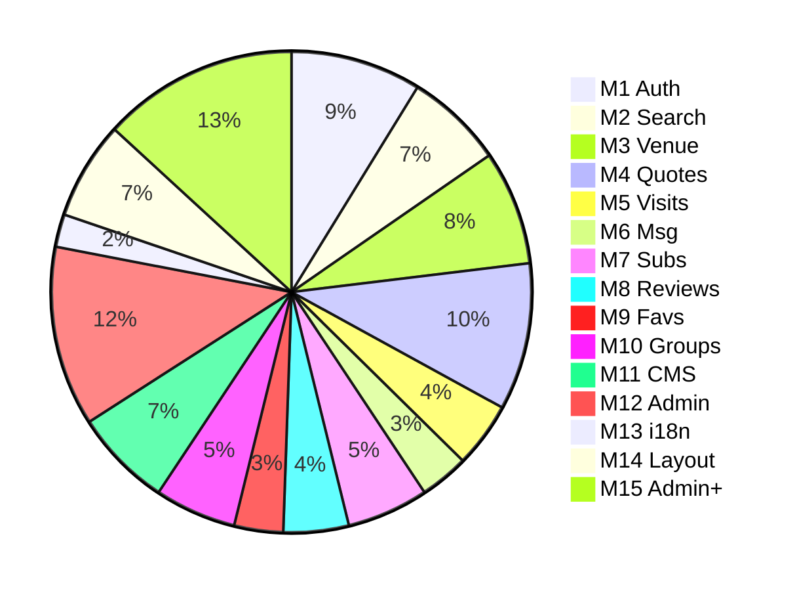

# WBS : Venues

> Work Breakdown Structure. **3 levels**: Module > Feature > Story.

## Changelog

| Date       | Change                                     |
| ---------- | ------------------------------------------ |
| 2026-03-12 | Initial WBS creation from V1/V2 scoping   |
| 2026-03-13 | Add F14.4 (US-179 to US-182) from WBS audit: partner page, legal, Calendly, Remove.bg |

## Breakdown structure

```
Module (= epic / application block)
  └── Feature (= business capability)
        └── Story (= deliverable unit, estimated, testable)
```

| Level       | Granularity                           | Stakeholder    | Naming convention   |
| ----------- | ------------------------------------- | -------------- | ------------------- |
| **Module**  | Application block (15 modules)        | Management, PO | M1, M2, M3...       |
| **Feature** | Business capability (2-8 per module)  | PO, Business   | F1.1, F1.2, F2.1... |
| **Story**   | Deliverable unit (1-5 man-days)       | Dev, QA        | US-001, US-002...   |

## Summary by module

| Module                       | Features | Stories | Charge (JH) | Phase |
| ---------------------------- | -------- | ------- | ----------- | ----- |
| M1: Authentication           | 5        | 16      | 32          | V1    |
| M2: Search & Discovery       | 4        | 12      | 25          | V1    |
| M3: Venue Management         | 4        | 14      | 28          | V1    |
| M4: Quotes / RFQ             | 5        | 18      | 41          | V1    |
| M5: Visits                   | 3        | 8       | 18          | V1    |
| M6: Messaging                | 2        | 6       | 12          | V1    |
| M7: Subscriptions & Payments | 4        | 10      | 22          | V1    |
| M8: Reviews & Ratings        | 3        | 8       | 15          | V1    |
| M9: Favorites                | 2        | 6       | 10          | V1    |
| M10: Groups & Partners       | 3        | 10      | 20          | V1    |
| M11: Content / CMS           | 4        | 12      | 20          | V1    |
| M12: Admin (Core)            | 6        | 22      | 41          | V1    |
| M13: i18n & Localization     | 2        | 4       | 10          | V1    |
| M14: Navigation & Layout     | 4        | 12      | 21          | V1    |
| M15: Admin (Advanced)        | 8        | 24      | 56          | V2   |
| **Total**                    | **59**   | **182** | **371**     |       |

### Story distribution by module



***

## M1 : Authentication

> Registration, login, and account management for clients and partners.

### F1.1 : Email Registration

> Email-based account creation for clients and partners.

| ID     | Story                | Role    | I want to...                                                     | P  | Charge | AC summary                                                  |
| ------ | -------------------- | ------- | ---------------------------------------------------------------- | - | ------ | ----------------------------------------------------------- |
| US-001 | Client email signup  | Client  | register with email, password, company info                      | P0 | 3 JH   | Form validation, confirmation email, SIRET prefill          |
| US-002 | Partner email signup | Partner | register with email, password, venue category, subscription choice | P0 | 4 JH   | Category selection, group request, subscription redirect    |
| US-003 | Email verification   | User    | verify my email address via confirmation link                    | P0 | 2 JH   | Token-based verification, expiry, resend option             |

### F1.2 : SSO

> Google and LinkedIn OAuth2 login.

| ID     | Story              | Role | I want to...                         | P  | Charge | AC summary                                      |
| ------ | ------------------ | ---- | ------------------------------------ | - | ------ | ----------------------------------------------- |
| US-004 | Google SSO         | User | log in or sign up with Google        | P1 | 2 JH   | OAuth2 flow, account linking, profile prefill   |
| US-005 | LinkedIn SSO       | User | log in or sign up with LinkedIn      | P1 | 2 JH   | OAuth2 flow, account linking, profile prefill   |

### F1.3 : Login

> Email/password login.

| ID     | Story               | Role | I want to...                               | P  | Charge | AC summary                                             |
| ------ | ------------------- | ---- | ------------------------------------------ | - | ------ | ------------------------------------------------------ |
| US-006 | Email/password login | User | log in with my email and password          | P0 | 1 JH   | Email + password fields, error messages, redirect home |
| US-007 | Remember me         | User | stay logged in across sessions             | P1 | 1 JH   | Persistent session token, checkbox toggle              |

### F1.4 : Password Recovery

> OTP-based password reset.

| ID     | Story           | Role | I want to...                                 | P  | Charge | AC summary                                     |
| ------ | --------------- | ---- | -------------------------------------------- | - | ------ | ---------------------------------------------- |
| US-008 | Forgot password | User | receive an OTP to reset my password          | P0 | 2 JH   | Email input, OTP sent, validity timer          |
| US-009 | Password reset  | User | set a new password after OTP verification    | P0 | 1 JH   | New + confirmation fields, complexity rules    |

### F1.5 : Profile Management

> Profile editing, avatar, subscription choice.

| ID     | Story                     | Role    | I want to...                                         | P  | Charge | AC summary                                                |
| ------ | ------------------------- | ------- | ---------------------------------------------------- | - | ------ | --------------------------------------------------------- |
| US-010 | View/edit profile         | User    | view and edit my personal information                | P0 | 2 JH   | Display name, email, company; edit mode with validation   |
| US-011 | Change password           | User    | change my password from my profile                   | P1 | 1 JH   | Current + new + confirmation fields, complexity rules     |
| US-012 | Upload/change avatar      | User    | upload or change my profile photo                    | P1 | 2 JH   | Image upload, cropping, preview, size validation          |
| US-013 | Delete account            | User    | permanently delete my account                        | P1 | 2 JH   | Confirmation modal, data deletion, email notification     |
| US-014 | Partner profile info      | Partner | add languages, values, anecdote to my profile        | P1 | 2 JH   | Multi-select languages, free-text fields, preview         |
| US-015 | Partner subscription choice | Partner | choose my subscription plan during registration      | P0 | 3 JH   | Plan display by category, selection, redirect to payment  |
| US-016 | Group creation request    | Partner | request creation of a new group during signup        | P1 | 2 JH   | Popup form, group name, description, admin notification   |

***

## M2 : Search & Discovery

> Venue search, filtering, comparison, and category browsing.

### F2.1 : Basic Search

> Keyword search, filters, sorting.

| ID     | Story                  | Role   | I want to...                                | P  | Charge | AC summary                                            |
| ------ | ---------------------- | ------ | ------------------------------------------- | - | ------ | ----------------------------------------------------- |
| US-017 | Keyword search         | Client | search venues by keyword                    | P0 | 3 JH   | Search bar, results list, relevance scoring           |
| US-018 | Filter by type/dest    | Client | filter by type, destination, lifestyle      | P0 | 3 JH   | Multi-select filters, instant results update          |
| US-019 | Sort results           | Client | sort search results                         | P1 | 1 JH   | Sort by relevance, rating, newest; persistent choice  |

### F2.2 : Advanced Search

> Multi-criteria filtering (positioning, capacity, services).

| ID     | Story                  | Role   | I want to...                                            | P  | Charge | AC summary                                                     |
| ------ | ---------------------- | ------ | ------------------------------------------------------- | - | ------ | -------------------------------------------------------------- |
| US-020 | Advanced filters popup | Client | filter by positioning, services, capacity, rooms        | P1 | 3 JH   | Modal with multi-criteria, capacity slider, services checkboxes |
| US-021 | Filter by partner type | Client | filter venues by group or independent partner           | P1 | 1 JH   | Toggle group/independent, results update                       |

### F2.3 : Saved Searches

> Save and reuse search criteria.

| ID     | Story               | Role   | I want to...                        | P  | Charge | AC summary                                    |
| ------ | ------------------- | ------ | ----------------------------------- | - | ------ | --------------------------------------------- |
| US-022 | Save a search       | Client | save my current search criteria     | P2 | 2 JH   | Save button, name input, linked to account    |
| US-023 | View saved searches | Client | see my saved searches               | P2 | 2 JH   | List view, re-execute search, last used date  |
| US-024 | Delete saved search | Client | remove a saved search               | P2 | 1 JH   | Delete button, confirmation                   |

### F2.4 : Venue Comparison

> Side-by-side venue comparison, category browsing on homepage.

| ID     | Story                  | Role   | I want to...                                 | P  | Charge | AC summary                                              |
| ------ | ---------------------- | ------ | -------------------------------------------- | - | ------ | ------------------------------------------------------- |
| US-025 | Add to comparison      | Client | add venues to a comparison list              | P1 | 2 JH   | Compare button on venue card, max 4 venues              |
| US-026 | Comparison view        | Client | compare venues side by side                  | P1 | 3 JH   | Table layout: capacity, services, rating, location      |
| US-027 | Remove from comparison | Client | remove a venue from comparison               | P1 | 1 JH   | Remove button per venue, empty state                    |
| US-028 | Category browsing      | Client | browse venues by category cards on homepage  | P0 | 3 JH   | Cards with image, name, venue count; click to filtered list |

***

## M3 : Venue Management

> Venue CRUD, public display, and partner management dashboard.

### F3.1 : Venue Listing

> Venue creation, image upload, preview before publish.

| ID     | Story                | Role    | I want to...                                   | P  | Charge | AC summary                                                  |
| ------ | -------------------- | ------- | ---------------------------------------------- | - | ------ | ----------------------------------------------------------- |
| US-029 | Create venue         | Partner | create a venue with full details               | P0 | 4 JH   | Multi-step form: info, capacity, services, equipment, location |
| US-030 | Upload venue images  | Partner | upload images for my venue                     | P0 | 2 JH   | Multi-image upload, drag-and-drop ordering, size validation |
| US-031 | Venue preview        | Partner | preview my venue before publishing             | P1 | 2 JH   | Read-only preview matching public display, publish button   |

### F3.2 : Venue Detail Page

> Public venue page (gallery, map, capacity, reviews).

| ID     | Story                  | Role   | I want to...                                    | P  | Charge | AC summary                                                  |
| ------ | ---------------------- | ------ | ----------------------------------------------- | - | ------ | ----------------------------------------------------------- |
| US-032 | Venue info display     | Client | see venue details, images, and location on map  | P0 | 3 JH   | Image gallery, description, map embed, partner info         |
| US-033 | Venue capacity/services | Client | see venue capacity, services, and equipment     | P0 | 2 JH   | Structured display: rooms, capacity ranges, service badges  |
| US-034 | Venue reviews display  | Client | see reviews on a venue page                     | P0 | 1 JH   | Review list, average rating, sorted by date                 |

### F3.3 : Partner Venue Management

> Partner dashboard: list, edit, pause, delete own venues.

| ID     | Story             | Role    | I want to...                         | P  | Charge | AC summary                                         |
| ------ | ----------------- | ------- | ------------------------------------ | - | ------ | -------------------------------------------------- |
| US-035 | List my venues    | Partner | see all my venues in one place       | P0 | 1 JH   | Table/card list, status badges, quick actions      |
| US-036 | Edit venue        | Partner | edit my venue details                | P0 | 2 JH   | Same form as creation, pre-filled, save/cancel     |
| US-037 | Pause/unpause     | Partner | temporarily hide my venue            | P1 | 1 JH   | Toggle button, status change, confirmation         |
| US-038 | Delete venue      | Partner | permanently remove my venue          | P1 | 1 JH   | Confirmation modal, cascade deletion of related data |

### F3.4 : Homepage Venues

> Homepage venue sections: latest, featured, categories, testimonials.

| ID     | Story                  | Role   | I want to...                                   | P  | Charge | AC summary                                                |
| ------ | ---------------------- | ------ | ---------------------------------------------- | - | ------ | --------------------------------------------------------- |
| US-039 | Latest venues carousel | Client | see the newest venues on the homepage          | P1 | 3 JH   | Horizontal carousel, venue cards, auto-scroll             |
| US-040 | Featured venues        | Admin  | showcase selected venues on the homepage       | P1 | 2 JH   | Admin-managed selection, highlighted display              |
| US-041 | Category cards         | Client | see category cards with venue counts           | P0 | 2 JH   | Cards grid: image, label, count; click to category filter |
| US-042 | Testimonials carousel  | Client | see references and testimonials on homepage    | P2 | 2 JH   | Carousel with quotes, author, company                     |

***

## M4 : Quotes / RFQ

> Quote request workflow between clients and partners.

### F4.1 : Express Quote

> Single-venue quote request form.

| ID     | Story                   | Role   | I want to...                                    | P  | Charge | AC summary                                               |
| ------ | ----------------------- | ------ | ----------------------------------------------- | - | ------ | -------------------------------------------------------- |
| US-043 | Express quote form      | Client | fill a quick quote request form                 | P0 | 3 JH   | Event type, date, attendees, budget range, message       |
| US-044 | Quote submission        | Client | submit my quote and get notified                | P0 | 2 JH   | Confirmation screen, email notification to partner       |
| US-045 | Quote summary view      | Client | see the summary of my submitted quote           | P0 | 2 JH   | Read-only detail page, status indicator                  |

### F4.2 : Multi-venue Quote

> Quote request sent to multiple venues at once.

| ID     | Story                    | Role   | I want to...                                    | P  | Charge | AC summary                                                   |
| ------ | ------------------------ | ------ | ----------------------------------------------- | - | ------ | ------------------------------------------------------------ |
| US-046 | Select multiple venues   | Client | select several venues for a single quote        | P1 | 3 JH   | Checkbox selection from search/favorites, venue basket       |
| US-047 | Multi-venue quote form   | Client | send one quote request to multiple venues       | P1 | 3 JH   | Shared form, per-venue customization option                  |
| US-048 | Multi-venue tracking     | Client | track responses from each venue                 | P1 | 2 JH   | Status per venue (pending/responded/accepted), timeline view |

### F4.3 : Partner Quote Response

> Partner quote response and PDF generation.

| ID     | Story                | Role    | I want to...                                 | P  | Charge | AC summary                                               |
| ------ | -------------------- | ------- | -------------------------------------------- | - | ------ | -------------------------------------------------------- |
| US-049 | View incoming quotes | Partner | see all quote requests I received            | P0 | 2 JH   | List with filters (status, date), unread indicator       |
| US-050 | Respond to quote     | Partner | create a proposal in response to a quote     | P0 | 3 JH   | Proposal form: services, availability, message           |
| US-051 | Quote PDF generation | Partner | generate a PDF version of my proposal        | P1 | 3 JH   | PDF template, venue branding, download/email options     |

### F4.4 : Quote Management

> Quote list, accept, refuse, cancel for both roles.

| ID     | Story                  | Role    | I want to...                                     | P  | Charge | AC summary                                                  |
| ------ | ---------------------- | ------- | ------------------------------------------------ | - | ------ | ----------------------------------------------------------- |
| US-052 | Client quote list      | Client  | view my quotes (sent/pending/accepted/refused)   | P0 | 3 JH   | Filterable list, status badges, date sorting                |
| US-053 | Partner quote list     | Partner | view my quotes (received/responded/accepted)     | P0 | 2 JH   | Filterable list, response status, client info               |
| US-054 | Accept quote           | Client  | accept a partner proposal                        | P0 | 2 JH   | Accept button, confirmation, partner notification           |
| US-055 | Refuse quote           | Client  | refuse a proposal with a reason                  | P1 | 1 JH   | Refuse button, reason dropdown/text, partner notification   |
| US-056 | Cancel quote           | Client  | cancel my own quote request                      | P1 | 1 JH   | Cancel button, reason input, partner notification           |

### F4.5 : Quote Statistics

> Quote dashboards and notifications.

| ID     | Story                | Role    | I want to...                                    | P  | Charge | AC summary                                                |
| ------ | -------------------- | ------- | ----------------------------------------------- | - | ------ | --------------------------------------------------------- |
| US-057 | Client dashboard     | Client  | see an overview of my quote activity            | P2 | 2 JH   | Counters by status, recent activity, conversion rate      |
| US-058 | Partner dashboard    | Partner | see an overview of my quote activity            | P2 | 2 JH   | Counters by status, response time, acceptance rate        |
| US-059 | Quote notifications  | User    | receive notifications for quote updates         | P0 | 3 JH   | Email + in-app notifications, configurable preferences    |
| US-060 | Downloadable summary | User    | download a summary of my quote                  | P2 | 2 JH   | PDF export, includes all messages and proposal details    |

***

## M5 : Visits

> Visit scheduling, video calls, and visit lifecycle.

### F5.1 : Visit Request

> Visit request and scheduling.

| ID     | Story                   | Role   | I want to...                                   | P  | Charge | AC summary                                             |
| ------ | ----------------------- | ------ | ---------------------------------------------- | - | ------ | ------------------------------------------------------ |
| US-061 | Request a visit         | Client | request a visit from a venue page              | P0 | 2 JH   | Visit button on venue page, type selection (in-person/video) |
| US-062 | Visit scheduling        | Client | select a date and time for my visit            | P0 | 3 JH   | Calendar picker, time slots, partner availability      |
| US-063 | Visit confirmation      | User   | receive confirmation of my scheduled visit     | P0 | 1 JH   | Email notification, in-app confirmation, calendar link |

### F5.2 : Video Visit

> Twilio video call for remote visits.

| ID     | Story                  | Role | I want to...                                  | P  | Charge | AC summary                                           |
| ------ | ---------------------- | ---- | --------------------------------------------- | - | ------ | ---------------------------------------------------- |
| US-064 | Video call room        | User | join a video call for a venue visit (Twilio)  | P1 | 4 JH   | Twilio integration, room creation, join link, timer  |
| US-065 | Calendar integration   | User | add my visit to my calendar                   | P2 | 2 JH   | ICS file download, Google/Outlook calendar links     |

### F5.3 : Visit Management

> Visit list, accept/refuse/cancel.

| ID     | Story                  | Role    | I want to...                                  | P  | Charge | AC summary                                              |
| ------ | ---------------------- | ------- | --------------------------------------------- | - | ------ | ------------------------------------------------------- |
| US-066 | Client visit list      | Client  | view my upcoming and past visits              | P0 | 2 JH   | List with status, date, venue; past/upcoming tabs       |
| US-067 | Partner visit requests | Partner | view visit requests for my venues             | P0 | 2 JH   | List with client info, date, venue, status              |
| US-068 | Accept/refuse/cancel   | User    | accept, refuse, or cancel a visit             | P0 | 2 JH   | Action buttons, reason input for refusal, notifications |

***

## M6 : Messaging

> Socket-based messaging between clients and partners.

### F6.1 : Real-time Chat

> Socket.io messaging with file sharing.

| ID     | Story                  | Role | I want to...                                  | P  | Charge | AC summary                                              |
| ------ | ---------------------- | ---- | --------------------------------------------- | - | ------ | ------------------------------------------------------- |
| US-069 | Send/receive messages  | User | send and receive messages in real time        | P0 | 3 JH   | Socket.io integration, message input, delivery status   |
| US-070 | Message history        | User | see my message history and threads            | P0 | 2 JH   | Scrollable thread, date separators, load older messages |
| US-071 | File sharing           | User | share files and images in chat                | P1 | 2 JH   | Upload button, image preview, file type validation      |

### F6.2 : Messaging Management

> Conversation list, unread indicators, contact from venue page.

| ID     | Story                  | Role | I want to...                                    | P  | Charge | AC summary                                             |
| ------ | ---------------------- | ---- | ----------------------------------------------- | - | ------ | ------------------------------------------------------ |
| US-072 | Conversation list      | User | see all my conversations                        | P0 | 2 JH   | List sorted by last message, partner name/avatar       |
| US-073 | Unread indicators      | User | see which conversations have unread messages    | P0 | 2 JH   | Badge count on conversation, bold unread, global count |
| US-074 | Contact from venue     | User | start a conversation from a venue or profile    | P1 | 1 JH   | Contact button, creates or resumes conversation thread |

***

## M7 : Subscriptions & Payments

> Stripe-based subscription plans, payments, and lifecycle management.

### F7.1 : Subscription Plans

> Plan display and selection by category.

| ID     | Story                  | Role    | I want to...                                    | P  | Charge | AC summary                                               |
| ------ | ---------------------- | ------- | ----------------------------------------------- | - | ------ | -------------------------------------------------------- |
| US-075 | Display plans          | Partner | see available subscription plans by category    | P0 | 2 JH   | Plan cards with features, grouped by venue category      |
| US-076 | Monthly vs annual      | Partner | choose between monthly and annual billing       | P0 | 2 JH   | Toggle switch, savings display for annual                |

### F7.2 : Stripe Payment

> Stripe Checkout, confirmation, saved payment method.

| ID     | Story                  | Role    | I want to...                                    | P  | Charge | AC summary                                             |
| ------ | ---------------------- | ------- | ----------------------------------------------- | - | ------ | ------------------------------------------------------ |
| US-077 | Stripe checkout        | Partner | pay for my subscription via Stripe              | P0 | 4 JH   | Stripe Checkout redirect, success/cancel handling      |
| US-078 | Payment confirmation   | Partner | receive confirmation and receipt after payment  | P0 | 2 JH   | Success page, email receipt, invoice link              |
| US-079 | Save payment method    | Partner | save my card for future payments                | P2 | 1 JH   | Stripe customer portal, saved card display             |

### F7.3 : Subscription Management

> Upgrade, downgrade, cancellation.

| ID     | Story                  | Role    | I want to...                                    | P  | Charge | AC summary                                                |
| ------ | ---------------------- | ------- | ----------------------------------------------- | - | ------ | --------------------------------------------------------- |
| US-080 | View subscription      | Partner | see my active subscription details              | P0 | 1 JH   | Plan name, renewal date, payment method, status           |
| US-081 | Upgrade/downgrade      | Partner | change my subscription plan                     | P1 | 3 JH   | Plan comparison, prorated billing, confirmation           |
| US-082 | Cancel subscription    | Partner | cancel my subscription                          | P1 | 2 JH   | Cancellation flow, reason survey, end-of-period access    |

### F7.4 : Pioneer Subscription

> One-time lifetime plan with limited slots.

| ID     | Story                  | Role    | I want to...                                    | P  | Charge | AC summary                                               |
| ------ | ---------------------- | ------- | ----------------------------------------------- | - | ------ | -------------------------------------------------------- |
| US-083 | Pioneer plan           | Partner | subscribe to the Pioneer lifetime plan          | P1 | 3 JH   | One-time payment, lifetime access, distinct checkout flow |
| US-084 | Pioneer counter        | Partner | see how many Pioneer slots are remaining        | P1 | 2 JH   | Real-time counter display, sold-out state handling       |

***

## M8 : Reviews & Ratings

> Multi-criteria review submission, display, and management.

### F8.1 : Review Submission

> Review gated by accepted quote (3 criteria).

| ID     | Story                  | Role   | I want to...                                            | P  | Charge | AC summary                                                     |
| ------ | ---------------------- | ------ | ------------------------------------------------------- | - | ------ | -------------------------------------------------------------- |
| US-085 | Submit review          | Client | rate a venue on professionalism, reactivity, eco-friendliness | P0 | 3 JH | 3 criteria sliders, text comment, submit; min 1 criterion required |
| US-086 | Review after quote only | Client | leave a review only after a validated quote             | P0 | 1 JH   | Review button only visible after accepted quote, validation check |

### F8.2 : Review Display

> Review display on venue and partner pages.

| ID     | Story                  | Role    | I want to...                                    | P  | Charge | AC summary                                               |
| ------ | ---------------------- | ------- | ----------------------------------------------- | - | ------ | -------------------------------------------------------- |
| US-087 | Reviews on venue page  | Client  | see reviews on a venue page                     | P0 | 2 JH   | Review list, pagination, date sorting                    |
| US-088 | Reviews on partner page | Client | see reviews on a partner profile                | P1 | 2 JH   | Aggregated from all partner venues, average display      |
| US-089 | Average ratings        | Client  | see average ratings per criterion               | P0 | 1 JH   | Bar/star display per criterion, overall average          |
| US-090 | Partner reply          | Partner | reply to a review on my venue                   | P1 | 2 JH   | Reply form below review, single reply per review         |

### F8.3 : My Reviews

> User's own review list.

| ID     | Story                  | Role    | I want to...                                    | P  | Charge | AC summary                                        |
| ------ | ---------------------- | ------- | ----------------------------------------------- | - | ------ | ------------------------------------------------- |
| US-091 | Client review list     | Client  | see all reviews I have written                  | P1 | 2 JH   | List with venue name, date, rating, edit option   |
| US-092 | Partner review list    | Partner | see all reviews on my venues                    | P1 | 2 JH   | List with venue, client, date, rating, reply link |

***

## M9 : Favorites

> Venue and partner bookmarks with custom lists.

### F9.1 : Venue Favorites

> Toggle favorites, custom lists.

| ID     | Story                  | Role   | I want to...                                   | P  | Charge | AC summary                                             |
| ------ | ---------------------- | ------ | ---------------------------------------------- | - | ------ | ------------------------------------------------------ |
| US-093 | Toggle venue favorite  | Client | add or remove a venue from my favorites        | P0 | 1 JH   | Heart icon on venue card/detail, immediate toggle      |
| US-094 | Favorite lists         | Client | create custom lists for my favorite venues     | P2 | 2 JH   | Create list with name, assign venues, rename/delete    |
| US-095 | View favorite venues   | Client | see all my favorite venues                     | P0 | 2 JH   | Grid/list view, grouped by list or flat, quick access  |

### F9.2 : Partner Favorites

> Toggle partner favorites, custom lists.

| ID     | Story                   | Role   | I want to...                                    | P  | Charge | AC summary                                            |
| ------ | ----------------------- | ------ | ----------------------------------------------- | - | ------ | ----------------------------------------------------- |
| US-096 | Toggle partner favorite | Client | add or remove a partner from my favorites       | P1 | 1 JH   | Heart icon on partner card/profile, immediate toggle  |
| US-097 | View favorite partners  | Client | see all my favorite partners                    | P1 | 2 JH   | List view with partner name, category, venue count    |
| US-098 | Partner favorite lists  | Client | organize partner favorites into lists           | P2 | 2 JH   | Create list with name, assign partners, rename/delete |

***

## M10 : Groups & Partners

> Partner directory, group pages, and ethical commitment display.

### F10.1 : Partner Directory

> Partner list with filters, profile page.

| ID     | Story                  | Role   | I want to...                                      | P  | Charge | AC summary                                              |
| ------ | ---------------------- | ------ | ------------------------------------------------- | - | ------ | ------------------------------------------------------- |
| US-099 | Browse partners        | Client | browse partners alphabetically with filters       | P0 | 3 JH   | Alphabetical list, filters (category, location, group)  |
| US-100 | Partner profile page   | Client | see a partner profile with full details           | P0 | 2 JH   | Bio, venues list, reviews, contact, commitments         |
| US-101 | Partner statistics     | Client | see partner stats (venues by category/country)    | P2 | 2 JH   | Charts/counters: venue count by category and country    |

### F10.2 : Groups

> Group list, detail page, creation request.

| ID     | Story                  | Role   | I want to...                                      | P  | Charge | AC summary                                                  |
| ------ | ---------------------- | ------ | ------------------------------------------------- | - | ------ | ----------------------------------------------------------- |
| US-102 | Browse groups          | Client | browse groups alphabetically with search          | P1 | 2 JH   | Alphabetical list, search bar, group card with logo         |
| US-103 | Group detail page      | Client | see group details, venues, and partners           | P1 | 3 JH   | Group info, venue list, partner list, commitments           |
| US-104 | Group creation request | Partner | request creation of a new group during signup     | P1 | 2 JH   | Request form in signup flow, admin notification, status tracking |

### F10.3 : Ethical Commitments

> Environmental/ethical badges, "Cap vers l'avenir", partner video.

| ID     | Story                    | Role   | I want to...                                        | P  | Charge | AC summary                                            |
| ------ | ------------------------ | ------ | --------------------------------------------------- | - | ------ | ----------------------------------------------------- |
| US-105 | Partner commitments      | Client | see a partner ethical/environmental commitments     | P1 | 1 JH   | Badge/icon display on profile, tooltip with details   |
| US-106 | Group commitments        | Client | see a group commitments                             | P1 | 1 JH   | Badge/icon display on group page, tooltip with details |
| US-107 | Cap vers l'avenir        | Client | see the "Cap vers l'avenir" donation section        | P2 | 2 JH   | Dedicated section, association info, donation link     |
| US-108 | Partner video            | Client | watch a partner presentation video                  | P2 | 2 JH   | Embedded video player on partner profile, responsive  |

***

## M11 : Content / CMS

> Blog, FAQ, static pages (Strapi CMS), and custom project form.

### F11.1 : Blog

> Article list, detail, sharing, related articles.

| ID     | Story                  | Role   | I want to...                                    | P  | Charge | AC summary                                            |
| ------ | ---------------------- | ------ | ----------------------------------------------- | - | ------ | ----------------------------------------------------- |
| US-109 | Article list           | Client | browse articles with search and tags            | P1 | 2 JH   | List with thumbnails, tag filter, search bar          |
| US-110 | Article detail         | Client | read a full article                             | P1 | 2 JH   | Rich content display, author, date, share buttons     |
| US-111 | Article sharing        | Client | share an article on social media or by link     | P2 | 1 JH   | Share buttons (LinkedIn, Twitter, copy link)           |
| US-112 | Related articles       | Client | see related article suggestions                 | P2 | 2 JH   | Algorithm based on tags/category, carousel display    |

### F11.2 : FAQ

> FAQ page with search and contact form.

| ID     | Story                  | Role   | I want to...                                    | P  | Charge | AC summary                                           |
| ------ | ---------------------- | ------ | ----------------------------------------------- | - | ------ | ---------------------------------------------------- |
| US-113 | FAQ page               | Client | browse FAQ organized by themes                  | P1 | 2 JH   | Collapsible sections by theme, search integration    |
| US-114 | FAQ search             | Client | search within FAQ                               | P2 | 1 JH   | Search field, real-time filtering of questions       |
| US-115 | FAQ contact form       | Client | contact support if my question is not answered  | P1 | 2 JH   | Form: name, email, subject, message; send confirmation |

### F11.3 : Static Pages

> Strapi-managed pages: About, Glossary, Labels, Manifesto.

| ID     | Story                  | Role   | I want to...                                    | P  | Charge | AC summary                                         |
| ------ | ---------------------- | ------ | ----------------------------------------------- | - | ------ | -------------------------------------------------- |
| US-116 | About page             | Client | view the About page                             | P1 | 1 JH   | Rich content from Strapi, responsive layout        |
| US-117 | Glossary page          | Client | browse industry terms alphabetically            | P2 | 2 JH   | Alphabetical index, search, term definitions       |
| US-118 | Labels & Certifications | Client | see available labels and certifications         | P1 | 2 JH   | List with icons, descriptions, linked venues       |
| US-119 | Manifesto page         | Client | view the Manifesto page                         | P2 | 1 JH   | Rich content from Strapi, responsive layout        |

### F11.4 : Custom Project

> Custom event brief submission.

| ID     | Story                  | Role   | I want to...                                    | P  | Charge | AC summary                                             |
| ------ | ---------------------- | ------ | ----------------------------------------------- | - | ------ | ------------------------------------------------------ |
| US-120 | Custom project page    | Client | submit a custom event brief                     | P1 | 2 JH   | Multi-field form, file upload, confirmation, admin notification |

***

## M12 : Admin (Core)

> Admin CRUD for clients, partners, venues, content, groups, and dashboard.

### F12.1 : Client Management

> Client CRUD, block/unblock, delete.

| ID     | Story                  | Role  | I want to...                                    | P  | Charge | AC summary                                             |
| ------ | ---------------------- | ----- | ----------------------------------------------- | - | ------ | ------------------------------------------------------ |
| US-121 | Client list            | Admin | see all clients with filters                    | P0 | 2 JH   | Filterable table: name, email, status, date            |
| US-122 | Client detail          | Admin | see client details, stats, and notes            | P0 | 3 JH   | Profile info, quote history, activity log, admin notes |
| US-123 | Block/unblock client   | Admin | block or unblock a client account               | P0 | 1 JH   | Toggle action, reason input, client notification       |
| US-124 | Delete client          | Admin | permanently delete a client account             | P1 | 1 JH   | Confirmation modal, cascade deletion, GDPR compliance  |

### F12.2 : Partner Management

> Partner CRUD, block/unblock, subscription override.

| ID     | Story                    | Role  | I want to...                                        | P  | Charge | AC summary                                                  |
| ------ | ------------------------ | ----- | --------------------------------------------------- | - | ------ | ----------------------------------------------------------- |
| US-125 | Partner list             | Admin | see all partners with filters                       | P0 | 2 JH   | Filterable table: name, category, subscription, status      |
| US-126 | Partner detail           | Admin | see partner details, stats, subscription, venues    | P0 | 3 JH   | Profile, venue list, subscription info, activity log        |
| US-127 | Block/unblock partner    | Admin | block or unblock a partner account                  | P0 | 1 JH   | Toggle action, reason input, partner notification           |
| US-128 | Subscription management  | Admin | manage partner subscription status                  | P0 | 2 JH   | Override plan, extend period, force cancellation            |

### F12.3 : Venue Management

> Venue list, edit, approve/reject/pause, featured config, credits.

| ID     | Story                  | Role  | I want to...                                    | P  | Charge | AC summary                                                |
| ------ | ---------------------- | ----- | ----------------------------------------------- | - | ------ | --------------------------------------------------------- |
| US-129 | Venue list             | Admin | see all venues with filters                     | P0 | 2 JH   | Filterable table: name, partner, category, status         |
| US-130 | Venue detail/edit      | Admin | view and edit any venue                         | P0 | 2 JH   | Full edit form, save/cancel, change history               |
| US-131 | Approve/reject/pause   | Admin | approve, reject, or pause a venue               | P0 | 2 JH   | Action buttons, reason input, partner notification        |
| US-132 | Featured venues config | Admin | select venues to feature on homepage            | P1 | 1 JH   | Search and select venues, ordering, toggle active         |
| US-133 | Venue credits          | Admin | manage venue listing credits                    | P1 | 1 JH   | Credit balance display, manual adjustment, history log    |

### F12.4 : Content Management

> Blog, FAQ, labels, highlights CRUD.

| ID     | Story                  | Role  | I want to...                                    | P  | Charge | AC summary                                              |
| ------ | ---------------------- | ----- | ----------------------------------------------- | - | ------ | ------------------------------------------------------- |
| US-134 | Blog CRUD              | Admin | create, edit, and delete blog articles (Strapi) | P0 | 2 JH   | Strapi integration, rich text editor, image upload       |
| US-135 | FAQ CRUD               | Admin | manage FAQ entries                              | P0 | 2 JH   | CRUD interface, theme assignment, ordering               |
| US-136 | Label management       | Admin | add, approve, or reject labels                  | P1 | 2 JH   | Label list, approval workflow, icon upload               |
| US-137 | Highlight management   | Admin | manage homepage highlights                      | P2 | 1 JH   | CRUD for highlight blocks, image, link, ordering         |

### F12.5 : Group Management

> Group approval workflow and editing.

| ID     | Story                  | Role  | I want to...                                    | P  | Charge | AC summary                                             |
| ------ | ---------------------- | ----- | ----------------------------------------------- | - | ------ | ------------------------------------------------------ |
| US-138 | Group list & approval  | Admin | see group requests and approve/reject them      | P0 | 2 JH   | Request list, approve/reject actions, notification     |
| US-139 | Group detail/edit      | Admin | view and edit group information                 | P0 | 2 JH   | Edit form, partner list, venue list, save/cancel       |

### F12.6 : Basic Dashboard

> Admin login, dashboard counters, messaging view.

| ID     | Story                  | Role  | I want to...                                    | P  | Charge | AC summary                                             |
| ------ | ---------------------- | ----- | ----------------------------------------------- | - | ------ | ------------------------------------------------------ |
| US-140 | Admin login + profile  | Admin | log in to the admin panel and manage my profile | P0 | 2 JH   | Email/password login, profile edit, password change     |
| US-141 | Dashboard overview     | Admin | see key metrics on the dashboard                | P0 | 3 JH   | Counters: users, venues, quotes, subscriptions; period filter |
| US-142 | Messaging admin view   | Admin | monitor and manage platform conversations       | P1 | 2 JH   | Conversation list, read-only view, flag/archive actions |

***

## M13 : i18n & Localization

> i18n setup (next-intl / use-intl) and translation files.

### F13.1 : Translation Framework

> next-intl (frontend) and use-intl (admin) setup.

| ID     | Story                  | Role | I want to...                                     | P  | Charge | AC summary                                             |
| ------ | ---------------------- | ---- | ------------------------------------------------ | - | ------ | ------------------------------------------------------ |
| US-143 | Next.js i18n setup     | Dev  | set up i18n with next-intl in the frontend       | P0 | 3 JH   | next-intl config, locale routing, fallback locale      |
| US-144 | Admin i18n setup       | Dev  | set up i18n with use-intl in the admin           | P0 | 2 JH   | use-intl config, locale detection, fallback            |

### F13.2 : Content Translation

> FR/EN JSON files and language switcher.

| ID     | Story                  | Role | I want to...                                    | P  | Charge | AC summary                                              |
| ------ | ---------------------- | ---- | ----------------------------------------------- | - | ------ | ------------------------------------------------------- |
| US-145 | FR/EN translation files | Dev | have complete FR and EN translation files        | P0 | 3 JH   | JSON files per locale, all UI strings covered           |
| US-146 | Language switcher      | User | switch language from the header                 | P0 | 2 JH   | Dropdown in header, persistent choice, immediate switch |

> **Note :** `vi.json` exists in admin codebase but is not in WBS scope. To be scoped if VI support is confirmed.

***

## M14 : Navigation & Layout

> Header, footer, responsive layout, partner conversion page, legal pages.

### F14.1 : Header

> Header variants per auth state (visitor, client, partner).

| ID     | Story                  | Role    | I want to...                                    | P  | Charge | AC summary                                              |
| ------ | ---------------------- | ------- | ----------------------------------------------- | - | ------ | ------------------------------------------------------- |
| US-147 | Header (logged out)    | Visitor | see a header with login/signup CTAs             | P0 | 1 JH   | Logo, navigation links, login/signup buttons            |
| US-148 | Header (client)        | Client  | see a header with my account menu               | P0 | 2 JH   | Logo, nav links, avatar dropdown (profile, quotes, favorites, logout) |
| US-149 | Header (partner)       | Partner | see a header with my partner menu               | P0 | 2 JH   | Logo, nav links, avatar dropdown (profile, venues, quotes, subscription, logout) |

### F14.2 : Footer

> Footer: navigation, legal links, newsletter signup.

| ID     | Story                  | Role    | I want to...                                    | P  | Charge | AC summary                                         |
| ------ | ---------------------- | ------- | ----------------------------------------------- | - | ------ | -------------------------------------------------- |
| US-150 | Global footer          | Visitor | see a footer with navigation and legal links    | P0 | 2 JH   | Link sections: about, help, legal; responsive grid |
| US-151 | Newsletter signup      | Visitor | subscribe to the newsletter from the footer     | P1 | 1 JH   | Email input, submit button, confirmation message   |
| US-152 | Social media links     | Visitor | access social media profiles from the footer    | P2 | 1 JH   | Icon links to LinkedIn, Instagram, Facebook        |

### F14.3 : Layout

> Responsive breakpoints and auth layout.

| ID     | Story                  | Role    | I want to...                                     | P  | Charge | AC summary                                              |
| ------ | ---------------------- | ------- | ------------------------------------------------ | - | ------ | ------------------------------------------------------- |
| US-153 | Responsive layout      | User    | use the platform on mobile, tablet, and desktop  | P0 | 3 JH   | Breakpoints: mobile 375px, tablet 768px, desktop 1280px |
| US-154 | Auth layout            | Visitor | see a clean layout on login/signup pages         | P0 | 2 JH   | Centered card, branding, minimal navigation             |

### F14.4 : Partner Conversion & Utilities

> Partner conversion page, legal pages, Calendly embed, and Remove.bg integration.

| ID     | Story                          | Role    | I want to...                                                        | P  | Charge | AC summary                                                              |
| ------ | ------------------------------ | ------- | ------------------------------------------------------------------- | - | ------ | ----------------------------------------------------------------------- |
| US-179 | "Devenir partenaire" page      | Visitor | view the partner conversion page                                    | P1 | 2 JH   | Hero section, benefits list, testimonials, CTA to partner signup        |
| US-180 | Legal/policy pages             | Visitor | access CGU, CGV, Privacy policy, and Mentions legales               | P1 | 2 JH   | Structured legal pages, admin-editable content, footer links            |
| US-181 | Calendly demo booking          | Visitor | book a demo from About, Become Partner, or Custom Project pages     | P2 | 1 JH   | Calendly embed widget, configurable per page, tracking event            |
| US-182 | Remove.bg photo background     | Partner | have background automatically removed from profile and venue photos | P2 | 2 JH   | Remove.bg API call on upload, before/after preview, manual override     |

***

## M15 : Admin (Advanced) (V2)

> Deferred to V2 phase (contracted scope). Statistics, A/B testing, moderation, integrations.

> **Note :** US-169 (audit log, 2 JH) and US-171 (Axeptio, 2 JH) are reclassified to V1 delivery (see scope decisions). These 2 stories (4 JH) count toward V1 totals in the phase summary. All other M15 stories remain V2.

### F15.1 : Statistics

> Client, partner, visitor, and commercial analytics dashboards.

| ID     | Story                  | Role  | I want to...                                       | P  | Charge | AC summary                                              |
| ------ | ---------------------- | ----- | -------------------------------------------------- | - | ------ | ------------------------------------------------------- |
| US-155 | Client statistics      | Admin | see client analytics by period and type            | P1 | 3 JH   | Charts: registrations, activity, retention by period    |
| US-156 | Partner statistics     | Admin | see partner analytics by period, venue, category   | P1 | 3 JH   | Charts: signups, venues, quotes by category and period  |
| US-157 | Visitor statistics     | Admin | see visitor analytics by country and device        | P2 | 2 JH   | Charts: visits by country, device, browser; period filter |
| US-158 | Commercial statistics  | Admin | see commercial performance metrics                 | P2 | 2 JH   | Charts: conversion funnel, quote acceptance rate        |

### F15.2 : A/B Testing

> A/B test config and result tracking.

| ID     | Story                  | Role  | I want to...                                    | P  | Charge | AC summary                                              |
| ------ | ---------------------- | ----- | ----------------------------------------------- | - | ------ | ------------------------------------------------------- |
| US-159 | A/B test config        | Admin | configure A/B tests on the platform             | P2 | 3 JH   | Test name, variants, traffic split, target pages        |
| US-160 | A/B test results       | Admin | see A/B test metrics and winner                 | P2 | 3 JH   | Conversion rates per variant, confidence interval, winner tag |

### F15.3 : Advanced Subscription Management

> Plan editor, renewal reminders, non-payment blocking.

| ID     | Story                   | Role  | I want to...                                       | P  | Charge | AC summary                                               |
| ------ | ----------------------- | ----- | -------------------------------------------------- | - | ------ | -------------------------------------------------------- |
| US-161 | Plan editor             | Admin | edit subscription plans and features               | P1 | 2 JH   | Edit plan name, features, limits; versioning             |
| US-162 | Subscription reminders  | Admin | configure subscription renewal reminders           | P1 | 2 JH   | Reminder schedule (days before expiry), email template   |
| US-163 | Non-payment blocking    | Admin | automate blocking for non-payment                  | P1 | 2 JH   | Grace period config, automatic venue pause, notification |

### F15.4 : Notification System

> Email template editor, notification triggers, reminder scheduling.

| ID     | Story                   | Role  | I want to...                                    | P  | Charge | AC summary                                               |
| ------ | ----------------------- | ----- | ----------------------------------------------- | - | ------ | -------------------------------------------------------- |
| US-164 | Email template editor   | Admin | edit email notification templates               | P1 | 3 JH   | Rich text editor, variables, preview, test send          |
| US-165 | Notification triggers   | Admin | configure which events trigger notifications    | P1 | 2 JH   | Event list, toggle on/off, channel selection (email/in-app) |
| US-166 | Reminder scheduling     | Admin | set up automatic reminder schedules             | P2 | 2 JH   | Cron-style scheduling, reminder type, recipient rules    |

### F15.5 : Content Moderation

> Moderation queue, blacklist, audit log.

| ID     | Story                  | Role  | I want to...                                    | P  | Charge | AC summary                                               |
| ------ | ---------------------- | ----- | ----------------------------------------------- | - | ------ | -------------------------------------------------------- |
| US-167 | Moderation queue       | Admin | review flagged content in a moderation queue    | P1 | 2 JH   | Queue with preview, flag reason, approve/reject actions  |
| US-168 | Blacklist management   | Admin | manage blacklisted words and users              | P2 | 2 JH   | Word list CRUD, user blacklist, automatic flagging       |
| US-169 | Audit log              | Admin | see an action history for admin operations      | P1 | 2 JH   | Chronological log: user, action, target, timestamp       |

### F15.6 : Integrations

> ODOO sync, Axeptio cookies, Brevo campaigns.

| ID     | Story                  | Role  | I want to...                                       | P  | Charge | AC summary                                              |
| ------ | ---------------------- | ----- | -------------------------------------------------- | - | ------ | ------------------------------------------------------- |
| US-170 | ODOO integration       | Admin | sync data with ODOO ERP                            | P1 | 5 JH   | API sync: contacts, invoices, subscriptions; error handling |
| US-171 | Axeptio cookie consent | Admin | manage cookie consent via Axeptio                  | P0 | 2 JH   | Axeptio SDK integration, consent banner, preference storage |
| US-172 | Brevo campaigns        | Admin | manage email campaigns via Brevo                   | P2 | 2 JH   | Brevo API integration, list sync, campaign trigger      |

### F15.7 : Infrastructure Admin

> Backup UI, maintenance mode toggle.

| ID     | Story                  | Role  | I want to...                                    | P  | Charge | AC summary                                        |
| ------ | ---------------------- | ----- | ----------------------------------------------- | - | ------ | ------------------------------------------------- |
| US-173 | Backup management UI   | Admin | manage database backups from the admin panel    | P2 | 2 JH   | Backup list, trigger manual backup, restore option |
| US-174 | Maintenance mode       | Admin | toggle maintenance mode on the platform         | P1 | 1 JH   | Toggle switch, custom message, scheduled mode     |

### F15.8 : Advanced Features

> Translation management, media buying, donations, report export.

| ID     | Story                  | Role  | I want to...                                       | P  | Charge | AC summary                                               |
| ------ | ---------------------- | ----- | -------------------------------------------------- | - | ------ | -------------------------------------------------------- |
| US-175 | Translation management | Admin | manage translations from the admin UI              | P2 | 3 JH   | Key/value editor per locale, missing translations flag   |
| US-176 | Media buying           | Admin | manage media buying campaigns                      | P2 | 2 JH   | Campaign list, charge tracking, performance metrics      |
| US-177 | Donation management    | Admin | manage association donations and partnerships      | P2 | 2 JH   | Association list, donation tracking, display config      |
| US-178 | Report generation      | Admin | generate platform reports                          | P2 | 2 JH   | Report templates, date range, PDF/CSV export             |

***

## Traceability matrix

| Story              | Feature       | Module | Phase | Test |
| ------------------ | ------------- | ------ | ----- | ---- |
| US-001 to US-003   | F1.1          | M1     | V1    | TBD  |
| US-004 to US-005   | F1.2          | M1     | V1    | TBD  |
| US-006 to US-007   | F1.3          | M1     | V1    | TBD  |
| US-008 to US-009   | F1.4          | M1     | V1    | TBD  |
| US-010 to US-016   | F1.5          | M1     | V1    | TBD  |
| US-017 to US-019   | F2.1          | M2     | V1    | TBD  |
| US-020 to US-021   | F2.2          | M2     | V1    | TBD  |
| US-022 to US-024   | F2.3          | M2     | V1    | TBD  |
| US-025 to US-028   | F2.4          | M2     | V1    | TBD  |
| US-029 to US-031   | F3.1          | M3     | V1    | TBD  |
| US-032 to US-034   | F3.2          | M3     | V1    | TBD  |
| US-035 to US-038   | F3.3          | M3     | V1    | TBD  |
| US-039 to US-042   | F3.4          | M3     | V1    | TBD  |
| US-043 to US-045   | F4.1          | M4     | V1    | TBD  |
| US-046 to US-048   | F4.2          | M4     | V1    | TBD  |
| US-049 to US-051   | F4.3          | M4     | V1    | TBD  |
| US-052 to US-056   | F4.4          | M4     | V1    | TBD  |
| US-057 to US-060   | F4.5          | M4     | V1    | TBD  |
| US-061 to US-063   | F5.1          | M5     | V1    | TBD  |
| US-064 to US-065   | F5.2          | M5     | V1    | TBD  |
| US-066 to US-068   | F5.3          | M5     | V1    | TBD  |
| US-069 to US-071   | F6.1          | M6     | V1    | TBD  |
| US-072 to US-074   | F6.2          | M6     | V1    | TBD  |
| US-075 to US-076   | F7.1          | M7     | V1    | TBD  |
| US-077 to US-079   | F7.2          | M7     | V1    | TBD  |
| US-080 to US-082   | F7.3          | M7     | V1    | TBD  |
| US-083 to US-084   | F7.4          | M7     | V1    | TBD  |
| US-085 to US-086   | F8.1          | M8     | V1    | TBD  |
| US-087 to US-090   | F8.2          | M8     | V1    | TBD  |
| US-091 to US-092   | F8.3          | M8     | V1    | TBD  |
| US-093 to US-095   | F9.1          | M9     | V1    | TBD  |
| US-096 to US-098   | F9.2          | M9     | V1    | TBD  |
| US-099 to US-101   | F10.1         | M10    | V1    | TBD  |
| US-102 to US-104   | F10.2         | M10    | V1    | TBD  |
| US-105 to US-108   | F10.3         | M10    | V1    | TBD  |
| US-109 to US-112   | F11.1         | M11    | V1    | TBD  |
| US-113 to US-115   | F11.2         | M11    | V1    | TBD  |
| US-116 to US-119   | F11.3         | M11    | V1    | TBD  |
| US-120             | F11.4         | M11    | V1    | TBD  |
| US-121 to US-124   | F12.1         | M12    | V1    | TBD  |
| US-125 to US-128   | F12.2         | M12    | V1    | TBD  |
| US-129 to US-133   | F12.3         | M12    | V1    | TBD  |
| US-134 to US-137   | F12.4         | M12    | V1    | TBD  |
| US-138 to US-139   | F12.5         | M12    | V1    | TBD  |
| US-140 to US-142   | F12.6         | M12    | V1    | TBD  |
| US-143 to US-144   | F13.1         | M13    | V1    | TBD  |
| US-145 to US-146   | F13.2         | M13    | V1    | TBD  |
| US-147 to US-149   | F14.1         | M14    | V1    | TBD  |
| US-150 to US-152   | F14.2         | M14    | V1    | TBD  |
| US-153 to US-154   | F14.3         | M14    | V1    | TBD  |
| US-179 to US-182   | F14.4         | M14    | V1    | TBD  |
| US-155 to US-158   | F15.1         | M15    | V2   | TBD  |
| US-159 to US-160   | F15.2         | M15    | V2   | TBD  |
| US-161 to US-163   | F15.3         | M15    | V2   | TBD  |
| US-164 to US-166   | F15.4         | M15    | V2   | TBD  |
| US-167 to US-168   | F15.5         | M15    | V2   | TBD  |
| US-169             | F15.5         | M15    | V1    | TBD  |
| US-170             | F15.6         | M15    | V2   | TBD  |
| US-171             | F15.6         | M15    | V1    | TBD  |
| US-172             | F15.6         | M15    | V2   | TBD  |
| US-173 to US-174   | F15.7         | M15    | V2   | TBD  |
| US-175 to US-178   | F15.8         | M15    | V2   | TBD  |

## Summary by phase

> Both V1 and V2 are contracted scope.

| Phase              | Modules | Stories | Charge (JH) |
| ------------------ | ------- | ------- | ----------- |
| V1                 | M1-M15  | 160     | 319         |
| V2 (contracted)   | M15     | 22      | 52          |
| **Total**          | M1-M15  | **182** | **371**     |
