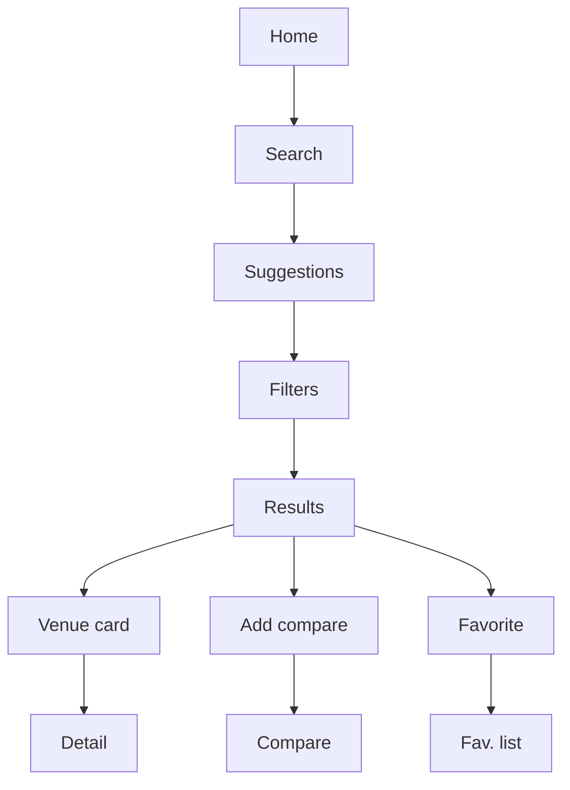
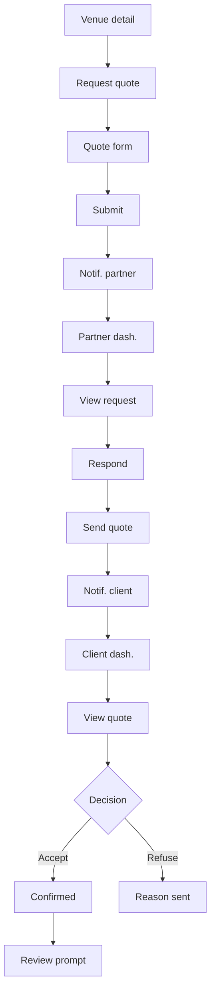
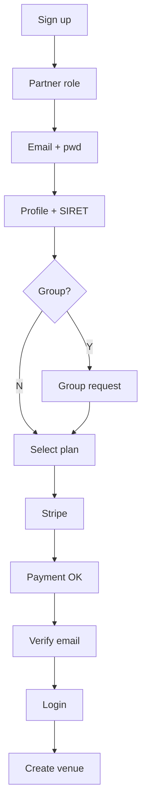
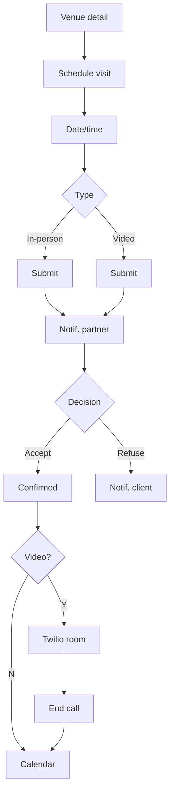
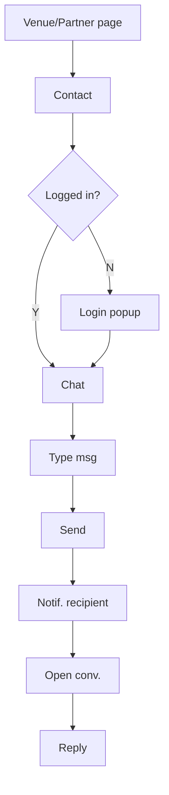
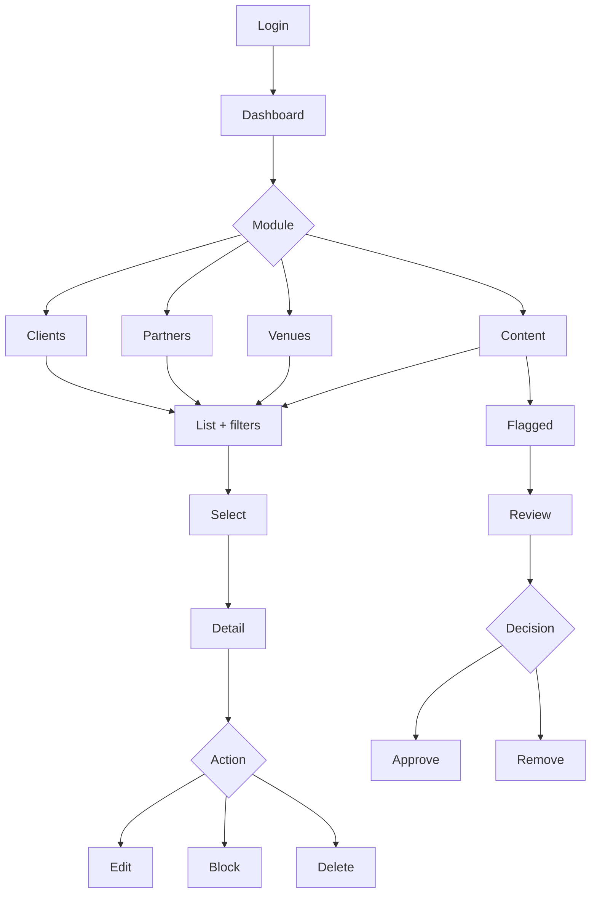
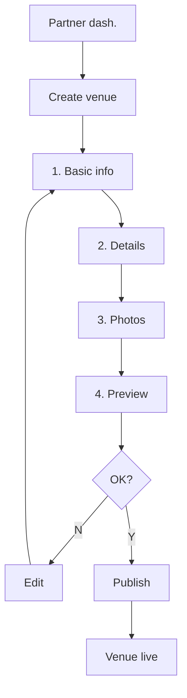
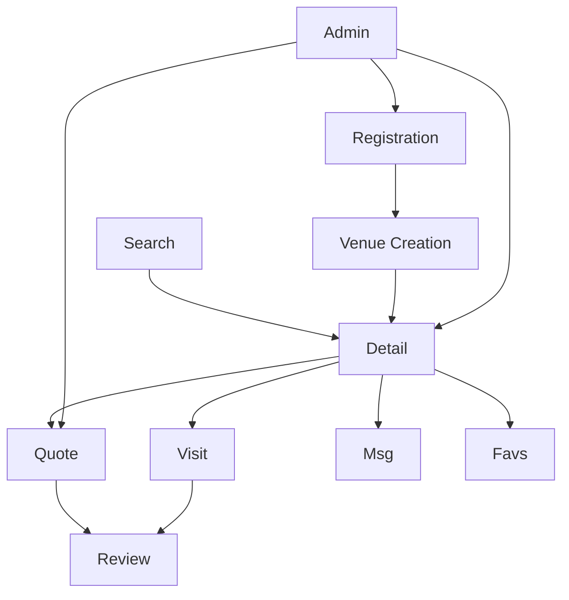

# User Flows : Venues

> 7 flows : search, quote requests, partner registration, visit scheduling, messaging, admin management, partner venue creation.

## 1. Venue Search & Discovery

User: Client (event organizer). Related stories: US-017 to US-028.

### Steps

| Step | User action | System response | Story |
|------|------------|----------------|-------|
| 1 | Opens homepage | Display search bar + category cards | US-028 |
| 2 | Types search keywords | Autocomplete suggestions appear | US-017 |
| 3 | Applies filters (type, destination, lifestyle) | Filtered results displayed | US-018 |
| 4 | Opens advanced filters | Popup with positioning, services, capacity | US-020 |
| 5 | Clicks on venue card | Navigate to venue detail page | US-032 |
| 6 | Clicks "Add to comparison" | Venue added to comparison bar | US-025 |
| 7 | Clicks "Compare" | Side-by-side comparison view | US-026 |
| 8 | Clicks heart icon | Venue added to favorites | US-093 |

### Error cases

| Condition | Expected behavior | Story |
|-----------|------------------|-------|
| No results found | Display "No venues match your criteria" + suggestion to broaden filters | US-017 |
| Search timeout | Display error message, retry button | US-017 |
| Invalid filter combination | Gray out incompatible options | US-020 |

## 2. Quote Request (Express + Multi-venue)

User: Client + Partner. Related stories: US-043 to US-060.

### Steps

| Step | Actor | Action | System response | Story |
|------|-------|--------|----------------|-------|
| 1 | Client | Clicks "Request quote" on venue page | Opens quote request form | US-043 |
| 2 | Client | Fills event details (date, capacity, requirements) | Form validation | US-043 |
| 3 | Client | Submits quote request | Confirmation + email notification to partner | US-044 |
| 4 | Partner | Views incoming request in dashboard | Request detail displayed | US-049 |
| 5 | Partner | Creates quote response (details, terms) | Form with PDF preview | US-050 |
| 6 | Partner | Submits quote | Notification to client | US-050 |
| 7 | Client | Views received quote in dashboard | Quote detail with download option | US-052 |
| 8 | Client | Accepts quote | Confirmation to both parties | US-054 |
| 9 | Client | (Alternative) Refuses with reason | Notification to partner | US-055 |
| 10 | System | After acceptance | Prompts both parties for review | US-086 |

**Multi-venue variant**: Client selects multiple venues (US-046), fills a single form (US-047), tracks responses per venue (US-048).

### Error cases

| Condition | Expected behavior | Story |
|-----------|------------------|-------|
| Partner does not respond within 48h | Reminder notification | US-059 |
| Quote request to blocked partner | Display "Venue temporarily unavailable" | US-043 |
| Expired subscription partner | Venue hidden from search, existing quotes honored | RG-03 |

## 3. Partner Registration & Subscription

User: Partner (venue owner). Related stories: US-002, US-015, US-016, US-075 to US-084.

### Steps

| Step | Action | System response | Story |
|------|--------|----------------|-------|
| 1 | Clicks "Become partner" | Redirect to partner signup | US-002 |
| 2 | Enters email, password | Validation (existing email check, password rules) | US-002 |
| 3 | Fills profile (company, SIRET, function, phone) | SIRET autocomplete for company info | US-002 |
| 4 | Selects venue category | Subscription options update based on category | US-015 |
| 5 | (Optional) Requests group creation | Popup form: name, HQ, website, description, commitments | US-016 |
| 6 | Selects subscription plan (monthly/annual/pioneer) | Plan details displayed | US-076 |
| 7 | Proceeds to Stripe checkout | Stripe payment form | US-077 |
| 8 | Confirms payment | Receipt + confirmation email | US-078 |
| 9 | Verifies email via link | Account activated | US-003 |
| 10 | Logs in, redirected to dashboard | "Create your first venue" prompt | US-029 |

### Error cases

| Condition | Expected behavior | Story |
|-----------|------------------|-------|
| Email already registered | "Account exists, please login" message | US-002 |
| SIRET not found | Manual company info entry | US-002 |
| Payment fails | Error message, retry option, no account created | US-077 |
| Pioneer slots exhausted | Display standard plans only | US-083 |

## 4. Visit Scheduling

User: Client + Partner. Related stories: US-061 to US-068.

### Steps

| Step | Actor | Action | System response | Story |
|------|-------|--------|----------------|-------|
| 1 | Client | Clicks "Schedule visit" on venue page | Opens scheduling form | US-061 |
| 2 | Client | Selects preferred date and time | Available slots displayed | US-062 |
| 3 | Client | Chooses visit type (in-person or video) | Form adapts to selection | US-063 |
| 4 | Client | Submits visit request | Confirmation + notification to partner | US-061 |
| 5 | Partner | Views visit request in dashboard | Request detail displayed | US-064 |
| 6 | Partner | Accepts or refuses with reason | Notification to client | US-065 |
| 7 | Both | (If video) Join video room at scheduled time | Twilio video session opens | US-066 |
| 8 | Both | Add confirmed visit to calendar | Calendar event created | US-068 |

### Error cases

| Condition | Expected behavior | Story |
|-----------|------------------|-------|
| No available slots | Display "No availability, contact partner directly" | US-062 |
| Video connection failure | Retry button + fallback to phone option | US-066 |
| Visit cancelled < 24h | Notification to other party + reschedule prompt | US-067 |

## 5. Messaging

User: Client + Partner. Related stories: US-069 to US-074.

### Steps

| Step | Actor | Action | System response | Story |
|------|-------|--------|----------------|-------|
| 1 | Client | Clicks "Contact" on venue/partner page | Auth check | US-069 |
| 2 | System | Checks authentication | If not logged in: login popup | US-069 |
| 3 | Client | Types and sends message | Message delivered, notification sent | US-070 |
| 4 | Partner | Receives in-app notification | Conversation appears in inbox | US-071 |
| 5 | Partner | Opens conversation and replies | Reply delivered to client | US-072 |
| 6 | Both | View conversation history | Threaded message view | US-073 |

### Error cases

| Condition | Expected behavior | Story |
|-----------|------------------|-------|
| Message to blocked user | "This user is unavailable" | US-074 |
| Attachment too large | "File exceeds maximum size" with limit displayed | US-070 |
| Network offline | Message queued, sent on reconnect | US-070 |

## 6. Admin Content Management

User: Admin. Related stories: US-121 to US-142.

### Steps

| Step | Action | System response | Story |
|------|--------|----------------|-------|
| 1 | Admin logs in | Dashboard with KPIs displayed | US-121 |
| 2 | Selects module (Clients, Partners, Venues, Content) | List view with filters and search | US-122 |
| 3 | Filters or searches items | Filtered results displayed | US-123 |
| 4 | Selects an item | Detail view with all fields | US-124 |
| 5 | Edits item fields | Inline editing with save confirmation | US-125 |
| 6 | Blocks a user or venue | Status updated, notifications sent | US-130 |
| 7 | Reviews flagged content | Content preview with context | US-135 |
| 8 | Approves or removes content | Status updated, author notified | US-136 |

### Error cases

| Condition | Expected behavior | Story |
|-----------|------------------|-------|
| Bulk delete without confirmation | Confirmation modal required | US-125 |
| Blocking partner with active quotes | Warning: "X active quotes will be affected" | US-130 |
| Content already moderated | Display "Already reviewed" badge, skip | US-135 |

## 7. Partner Venue Creation

User: Partner (venue owner). Related stories: US-029, US-030, US-031, US-182.

### Steps

| Step | Action | System response | Story |
|------|--------|----------------|-------|
| 1 | Partner clicks "Create venue" from dashboard | Opens multi-step creation form | US-029 |
| 2 | Fills basic info: name, category, address | Address geocoding and validation | US-029 |
| 3 | Fills details: capacity, services, equipment, positioning | Dynamic fields based on category selection | US-030 |
| 4 | Uploads venue photos | Image upload with drag-and-drop, gallery preview | US-031 |
| 5 | (Optional) Uses Remove.bg on photos | Background removal applied, before/after preview | US-182 |
| 6 | Reviews full venue preview | Read-only preview matching public detail page | US-030 |
| 7 | Publishes venue | Venue visible on marketplace, confirmation notification | US-031 |
| 8 | (Optional) Edits venue after publication | Returns to step form with pre-filled data | US-030 |

### Error cases

| Condition | Expected behavior | Story |
|-----------|------------------|-------|
| Invalid or unrecognized address | Error message with suggestion to verify, geocoding retry | US-029 |
| Missing required fields | Inline validation highlighting missing fields, step blocked | US-029 |
| Image upload failure (size, format) | Error with accepted formats and size limit displayed | US-031 |
| Remove.bg API unavailable | Graceful fallback: photo kept as-is, manual crop available | US-182 |
| Subscription expired during creation | Warning banner, publish blocked until subscription renewed | US-029 |

## 8. Flow overview

How all flows interconnect:

