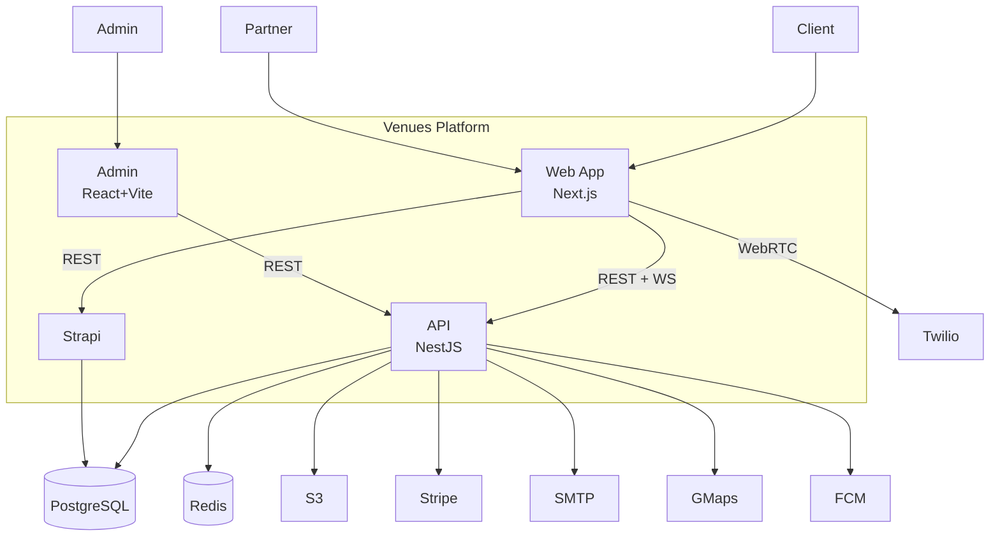
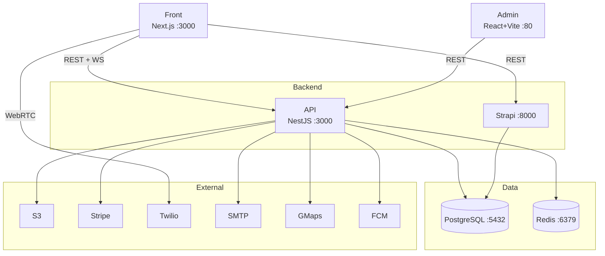
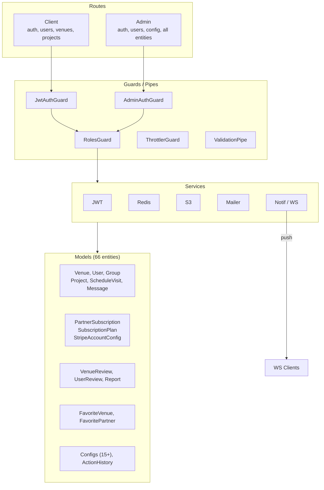

# Architecture : Venues

> Software architecture and technical choices. C4 model (Context, Container, Component).

## 1. Context View (C4 Level 1)

> The system in its environment: users, external systems, main flows.

### Actors and Systems

| Element | Type | Description |
|---|---|---|
| Client | Person | Event organizer searching venues, requesting quotes |
| Partner | Person | Venue owner listing properties, responding to quotes |
| Administrator | Person | Platform administrator managing all entities |
| Venues Web App | Container | Next.js 15 marketplace frontend (client + partner facing) |
| Admin Panel | Container | React + Vite admin dashboard (internal) |
| Venues API | Container | NestJS 11 REST API with Socket.io real-time, Swagger documentation |
| Strapi CMS | Container | Strapi v5 headless CMS for blog/magazine content |
| PostgreSQL | Data Store | Primary database (TypeORM), shared by API and Strapi |
| Redis | Data Store | Cache, rate limiting |
| AWS S3 | External Service | File and image storage |
| Stripe | External Service | Payment processing (checkout + advanced subscription management) |
| Twilio | External Service | Video call infrastructure (frontend SDK only) |
| Firebase (FCM) | External Service | Push notifications (planned, not yet implemented) |
| Google Maps / DU Maps (self-hosted) | External Service / maps.v2.volcanly.me | Geocoding, address autocomplete |
| SMTP (Gmail) | External Service | Transactional emails |

## 2. Container View (C4 Level 2)

> The main application building blocks, their technology, and interactions.

### Container Descriptions

| Container | Technology | Responsibility | Port |
|---|---|---|---|
| Front | Next.js 15, React 19, TypeScript, Tailwind | Marketplace UI (client + partner) | 3000 |
| Admin | React 19, Vite 6, TypeScript, Radix UI, Tailwind | Admin back-office | 80 (Nginx) |
| Back | NestJS 11, Node.js 18, TypeORM, Socket.io, class-validator, Swagger, Passport | REST API + WebSocket server | 3000 |
| Strapi | Strapi v5, Node.js 20 (pnpm) | Blog/content CMS | 8000 |
| PostgreSQL | PostgreSQL 16 (TypeORM) | Primary database (API + Strapi) | 5432 |
| Redis | Redis 4.7 | Cache, rate limiting | 6379 |

## 3. Component View (C4 Level 3): API Internals

> Internal structure of the NestJS API: routes, guards, services, and entities.

### API Domains

| Domain | Routes | Models | Description |
|---|---|---|---|
| Auth | `/auth/*` | User, UserVerify | Registration, login, JWT, OAuth, email verification |
| Users | `/user/*` | User | Profile management |
| Venues | `/venue/*` | Venue, VenueLabel, VenueActivity | Venue CRUD, search sync, bulk operations |
| Projects | `/projects/*` | Project | Quote/RFQ workflow |
| Schedule Visits | `/schedule-visits/*` | ScheduleVisit, Ticket | Visit scheduling, Twilio integration |
| Chat | `/chat/*`, `/chat-rooms/*` | Message, ChatRoom | Real-time messaging |
| Reviews | `/venue-reviews/*`, `/user-reviews/*` | VenueReview, UserReview | Rating and review system |
| Favorites | `/favorite-venues/*`, `/favorite-partners/*` | FavoriteVenue, FavoritePartner | Bookmarking |
| Groups | `/groups/*` | Group | Group management |
| Search | `/search/*` | (Elasticsearch) | Full-text search |
| Subscriptions | `/stripe-checkout/*`, `/subscription-plans/*` | PartnerSubscription, SubscriptionPlan | Stripe payments |
| Notifications | `/notifications/*` | Notification | Push and in-app notifications |
| Content | `/blog-posts/*`, `/mice-glossary/*` | (via Strapi + local) | Blog and glossary |
| Media | `/media/*` | Media | File upload (S3) |
| Config | `/config/*` | CommonConfig, VenueConfig, ... | Platform configuration |
| Admin | `/admin/*` | All entities | Admin CRUD for all modules |

## 4. ADR (Architecture Decision Records)

### ADR-001 : Express.js + MongoDB as Backend

- **Status** : Superseded (by ADR-006)
- **Date** : 2025-07
- **Context** : marketplace with document-based data (venues, quotes, bookings) requiring fast iteration.
- **Options considered** :
  1. NestJS + PostgreSQL : structured framework, strong typing, relational data
  2. Express + MongoDB : flexible schemas, fast iteration, large ecosystem
  3. Fastify + PostgreSQL : high performance, modern, relational data
- **Decision** : Express + MongoDB
- **Rationale** : document schemas suit venue/quote data, fast iteration for initial scope, team familiarity
- **Consequences** :
  - Positive : flexible schemas, large ecosystem
  - Negative : no built-in structure (manual organization), no SQL relations/joins

> Superseded 2025-08-05: backend migrated to NestJS + PostgreSQL + TypeORM within the first week of development. See ADR-006.

### ADR-002 : Next.js 15 as Marketplace Frontend

- **Status** : Accepted
- **Date** : 2025-07
- **Context** : SEO-critical marketplace requiring SSR, i18n, and modern React.
- **Options considered** :
  1. Next.js : SSR/SSG, mature i18n (next-intl), large React ecosystem
  2. Remix : modern SSR, simpler data loading, smaller ecosystem
  3. SvelteKit : lighter framework, smaller community
- **Decision** : Next.js 15 with App Router
- **Rationale** : SSR/SSG support, mature i18n (next-intl), team expertise
- **Consequences** :
  - Positive : SSR/SSG, mature i18n, large community
  - Negative : bundle size, App Router complexity

### ADR-003 : Separate Admin Panel (React + Vite)

- **Status** : Accepted
- **Date** : 2025-07
- **Context** : admin is internal-only, no SSR/SEO needed.
- **Options considered** :
  1. Admin within Next.js : shared codebase, SSR overhead for internal tool
  2. Separate React SPA with Vite : faster builds, simpler routing, independent deployment
- **Decision** : Separate React SPA with Vite
- **Rationale** : no SSR overhead, simpler SPA routing, independent deployment cycle
- **Consequences** :
  - Positive : faster builds, simpler routing, independent deployment
  - Negative : separate codebase, no shared components with front

### ADR-004 : Strapi v5 for Blog/Content

- **Status** : Accepted
- **Date** : 2025-07
- **Context** : blog/magazine content needs a CMS with admin UI for non-technical editors.
- **Options considered** :
  1. Custom blog in main app : full control, development overhead
  2. Strapi v5 self-hosted : extensible, no vendor lock-in
  3. Contentful : managed service, vendor dependency
- **Decision** : Strapi v5 self-hosted
- **Rationale** : extensible content types, no vendor lock-in, admin UI for editors
- **Consequences** :
  - Positive : extensible, self-hosted, no vendor lock-in
  - Negative : additional container to deploy, separate database (PostgreSQL)

### ADR-005 : Socket.io for Real-time

- **Status** : Accepted
- **Date** : 2025-07
- **Context** : messaging and notifications require bidirectional real-time communication.
- **Options considered** :
  1. Socket.io : fallback transports, room/channel support
  2. SSE (Server-Sent Events) : simpler, one-directional only
  3. Pusher : managed service, vendor dependency
- **Decision** : Socket.io
- **Rationale** : bidirectional, fallback transports, room/channel support
- **Consequences** :
  - Positive : fallback transports, room/channel support
  - Negative : persistent connections increase server resource usage

### ADR-006 : NestJS + PostgreSQL + TypeORM as Backend

- **Status** : Accepted
- **Date** : 2025-08
- **Context** : after initial Express + MongoDB scaffolding, the team migrated to NestJS + PostgreSQL for better structure, type safety, and relational data modeling.
- **Decision** : NestJS 11 + PostgreSQL + TypeORM
- **Rationale** : structured framework (decorators, modules, DI), TypeORM migrations for schema safety, relational model suits marketplace entities (venues, quotes, visits with FK relationships), Swagger auto-documentation, built-in validation (class-validator)
- **Consequences** :
  - Positive : type safety, auto-generated API docs, migration system, structured modules
  - Negative : steeper learning curve, heavier framework

## 5. Stack Choice Justification

| Criterion | Express + MongoDB + Next.js | NestJS + PostgreSQL + Next.js | Fastify + PostgreSQL + Remix |
|---|---|---|---|
| Development speed | ++ | + | + |
| SEO / SSR | ++ | ++ | ++ |
| Schema flexibility | ++ | - | - |
| Type safety | + | ++ | ++ |
| Ecosystem / community | ++ | ++ | + |
| Team expertise | ++ | + | + |
| Scalability | + | ++ | ++ |
| **Verdict** | Initial choice, superseded | **Selected** (migrated 2025-08) | Ruled out |

## 6. Repositories and Tools

| Repository | Content | Branch strategy |
|---|---|---|
| venues-0314/back | NestJS API + TypeORM entities | main, develop, staging, staging-release-*, feature/* |
| venues-0314/front | Next.js marketplace | main, dev, staging, feature/* |
| venues-0314/admin | React + Vite admin panel | main, dev, staging, feature/* |
| venues-0314/strapi | Strapi CMS | main, dev |
