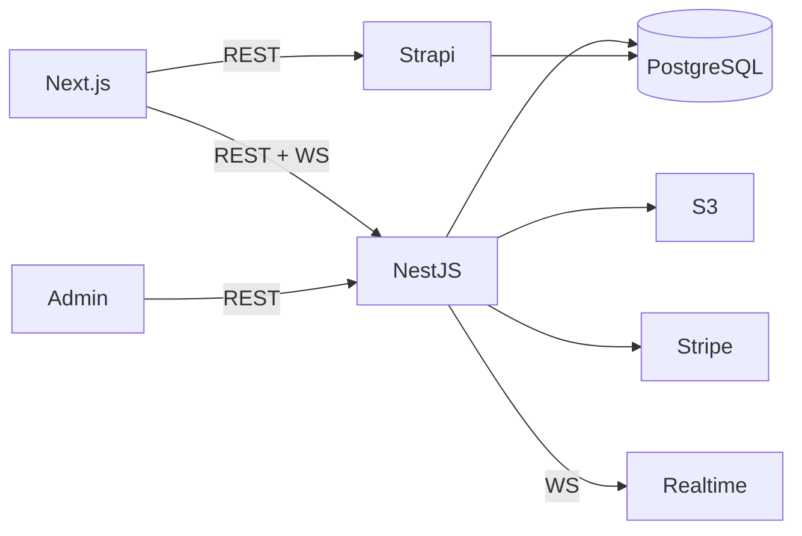

# BOM : Venues

> Bill of Materials : technical stack, dependencies, and services.

## 1. Backend Stack

| Component | Version | Role | License |
|---|---|---|---|
| Node.js | 22.x | Runtime (node:22-alpine) | MIT |
| NestJS | 11.0.1 | Application framework | MIT |
| TypeORM | 0.3.25 | PostgreSQL ORM | MIT |
| PostgreSQL (pg) | 8.16.3 | Database driver | MIT |
| @nestjs/swagger | 11.2.0 | API documentation | MIT |
| @nestjs/passport | 11.0.5 | Authentication | MIT |
| @nestjs/jwt | 11.0.0 | JWT token management | MIT |
| @nestjs/elasticsearch | 11.1.0 | Elasticsearch integration | MIT |
| @nestjs/websockets | 11.1.6 | WebSocket support | MIT |
| @nestjs/platform-socket.io | 11.1.6 | Socket.io adapter | MIT |
| @nestjs/throttler | 6.4.0 | Rate limiting | MIT |
| @nestjs/schedule | 6.0.0 | Task scheduling | MIT |
| @nestjs/config | 4.0.2 | Configuration management | MIT |
| @nestjs/event-emitter | 3.0.1 | Event system | MIT |
| @nestjs/axios | 4.0.1 | HTTP client | MIT |
| Stripe | 18.5.0 | Payment processing | MIT |
| Twilio | 5.10.1 | Video call infrastructure | MIT |
| @elastic/elasticsearch | 8.15.0 | Search engine client | Apache-2.0 |
| Socket.io | 4.8.1 | Real-time WebSocket | MIT |
| class-validator | 0.14.2 | Request validation | MIT |
| class-transformer | 0.5.1 | DTO transformation | MIT |
| bcrypt | 6.0.0 | Password hashing | MIT |
| nodemailer | 7.0.5 | Email sending | MIT |
| helmet | 8.1.0 | Security headers | MIT |
| passport | 0.7.0 | Authentication middleware | MIT |
| passport-jwt | 4.0.1 | JWT strategy | MIT |
| rxjs | 7.8.1 | Reactive extensions | Apache-2.0 |
| typeorm-extension | 3.7.3 | TypeORM utilities (seeding) | MIT |

## 2. Frontend Stack (Marketplace)

| Component | Version | Role | License |
|---|---|---|---|
| Next.js | 15.4.10 | React framework (SSR/SSG) | MIT |
| React | 19.2.3 | UI library | MIT |
| TypeScript | latest | Type safety | Apache-2.0 |
| Tailwind CSS | latest | Utility-first CSS | MIT |
| Radix UI | latest | Accessible UI primitives | MIT |
| next-intl | 4.3.4 | Internationalization | MIT |
| Chart.js | latest | Data visualization | MIT |
| Recharts | latest | React charts | MIT |
| Socket.io Client | 4.7.5 | Real-time client | MIT |
| React Hook Form | latest | Form management | MIT |
| Zod | latest | Schema validation | MIT |
| @react-oauth/google | latest | Google OAuth | MIT |
| @vis.gl/react-google-maps | latest | Maps integration (Google / DU Maps self-hosted) | MIT |
| Twilio Video | 2.34.0 | Video calls | MIT |
| Puppeteer | 24.33.0 | PDF generation | Apache-2.0 |
| @react-pdf/renderer | latest | PDF rendering | MIT |
| axios | latest | HTTP client | MIT |
| @tanstack/react-query | latest | Data fetching/cache | MIT |
| zustand | latest | State management | MIT |
| sonner | latest | Toast notifications | MIT |
| framer-motion | latest | Animations | MIT |
| react-markdown | latest | Markdown rendering | MIT |
| embla-carousel-react | latest | Carousel component | MIT |
| yup | latest | Schema validation | MIT |
| nuqs | latest | URL query state | MIT |
| cmdk | latest | Command palette | MIT |
| date-fns | latest | Date utilities | MIT |
| lodash | latest | Utility functions | MIT |
| next-themes | latest | Theme management | MIT |

## 3. Admin Panel Stack

| Component | Version | Role | License |
|---|---|---|---|
| React | 19.0.0 | UI library | MIT |
| Vite | 6.0.11 | Build tool | MIT |
| TypeScript | 5.7.2 | Type safety | Apache-2.0 |
| Tailwind CSS | 3.4.17 | Styling | MIT |
| Radix UI | latest | UI components | MIT |
| React Hook Form | 7.60.0 | Form management | MIT |
| Zustand | 5.0.6 | State management | MIT |
| TanStack React Query | 5.83.0 | Data fetching/cache | MIT |
| Tiptap | 3.6.1 | Rich text editor | MIT |
| Recharts | 2.15.4 | Charts | MIT |
| @hello-pangea/dnd | latest | Drag and drop | Apache-2.0 |
| use-intl | 4.3.4 | i18n | MIT |
| React Router | 6.x | Routing | MIT |
| Sonner | 2.0.6 | Toast notifications | MIT |
| axios | 1.10.0 | HTTP client | MIT |

## 4. CMS Stack

| Component | Version | Role | License |
|---|---|---|---|
| Strapi | 5.33.3 | Headless CMS | MIT (EE features proprietary) |
| Node.js | 20.x | Runtime (node:20-alpine) | MIT |
| PostgreSQL | latest | CMS database (production) | PostgreSQL License |
| better-sqlite3 | latest | CMS database (dev/local) | MIT |
| React | 18.0.0 | Admin UI | MIT |
| styled-components | 6.0.0 | CSS-in-JS | MIT |
| AWS S3 Provider | latest | Media storage | MIT |

> Strapi uses **pnpm** as its package manager.

## 5. External Services

| Service | Usage | Criticality | Fallback |
|---|---|---|---|
| PostgreSQL | Primary database (backend + Strapi) | Critical | Daily pg_dump backups |
| Redis | Cache, rate limiting | High | In-memory fallback |
| AWS S3 | File storage | High | Local storage (dev) |
| Stripe | Subscription payments | Critical | Manual invoicing |
| Twilio | Video calls | Medium | Calendar link sharing |
| Google Maps API / DU Maps (self-hosted) | Geocoding, autocomplete | High | Manual address entry |
| Gmail SMTP | Transactional emails | High | Brevo SMTP fallback |
| Brevo | Newsletter | Medium | Manual email lists |
| Remove.bg | Background removal (photos) | Low | Manual photo editing |

## 6. Infrastructure and DevOps

| Component | Version | Role | License |
|---|---|---|---|
| Docker | latest | Containerization | Apache-2.0 |
| Nginx | latest | Reverse proxy (admin) | BSD-2 |
| Node.js 22 (alpine) | 22.x | Backend and Frontend container base | MIT |
| Node.js 20 (alpine) | 20.x | Admin build + Strapi container | MIT |
| GitLab CI/CD | latest | Build and deploy pipeline | - |

## 7. Development Tools

| Tool | Role |
|---|---|
| ESLint (@typescript-eslint) | Backend linting |
| Prettier | Code formatting (admin, front) |
| Vitest | Admin unit tests |
| Jest | Frontend + admin tests |
| React Testing Library | Component tests |
| class-validator | Backend request validation |
| Swagger (@nestjs/swagger) | API documentation |

## 8. Dependency Criticality Matrix

### Dependency Impact Table

| Dependency | Impact if unavailable | Mitigation |
|---|---|---|
| PostgreSQL | Full service outage (data store) | Daily pg_dump backups, point-in-time recovery |
| Redis | Degraded performance (no cache) | In-memory fallback |
| AWS S3 | No file uploads or media display | Local storage in dev |
| NestJS | Full API outage | Stable release, no frequent updates |
| Next.js | Frontend unavailable | Static fallback pages |
| Socket.io | No real-time messaging | Polling fallback |
| Stripe | No payment processing | Manual invoicing |
| Twilio | No video calls | Calendar link sharing |

## 9. License Audit

All production dependencies use commercially compatible licenses : MIT, Apache-2.0, BSD-2, BSD-3, ISC, PostgreSQL License. No copyleft (GPL/AGPL) in the production tree. Strapi EE features are proprietary; only the MIT-licensed open-source core is used.
