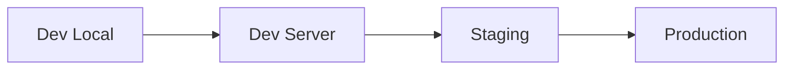
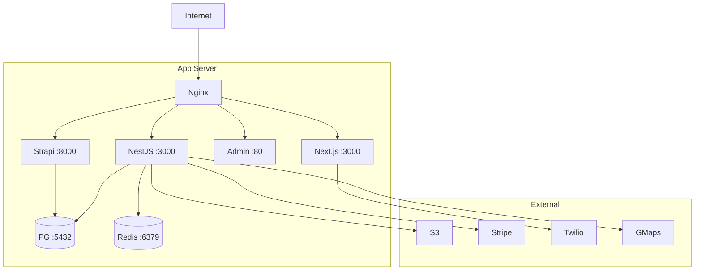
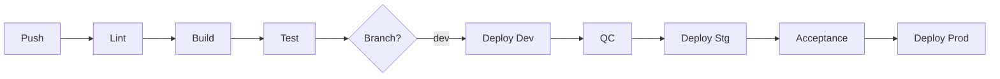

# Infrastructure : Venues

> Environment topology, server specifications, CI/CD pipeline.

## 1. Environment Topology

| Environment | Usage | URL Pattern | Branch |
|---|---|---|---|
| Development | Local development | localhost:3000 (front + api), localhost:80 (admin), localhost:8000 (strapi) | feature/* |
| Dev Server | Integration testing | dev.venues.* | dev (front, admin, strapi), develop (back) |
| Staging | Client acceptance (QC-validated features only) | staging.venues.* | staging-release-* |
| Production | Live platform | venues.* | main |

## 2. Hosting Architecture

### Server Specifications

| Component | Base Image | Resources | Notes |
|---|---|---|---|
| Backend | node:22-alpine | 1 vCPU, 1 GB RAM | NestJS API + Socket.io + Swagger (uses yarn) |
| Frontend | node:22-alpine | 1 vCPU, 1 GB RAM | Next.js standalone (uses pnpm via corepack) |
| Admin | node:20-alpine (build), nginx (serve) | 0.5 vCPU, 512 MB RAM | Static SPA behind Nginx (uses yarn) |
| Strapi | node:20-alpine | 1 vCPU, 1 GB RAM | CMS with PostgreSQL (uses pnpm) |
| Redis | redis:7-alpine | 0.5 vCPU, 256 MB RAM | Cache + rate limiting |
| PostgreSQL | postgres:16-alpine | 1 vCPU, 1 GB RAM | Primary database (backend + Strapi) |

## 3. CI/CD Pipeline

| Stage | Tool | Trigger | Actions |
|---|---|---|---|
| Lint | ESLint / Prettier | Push to feature/* | Code quality check |
| Build | Docker | Push to dev | Build container images |
| Deploy Dev | GitLab CI | Merge to dev/develop | Deploy to dev server |
| QC Validation | Manual | Dev deployment | QC team smoke tests + regression |
| Deploy Staging | GitLab CI | Manual trigger | Deploy QC-validated features |
| Client Acceptance | Manual | Staging deployment | Client reviews and validates |
| Deploy Production | GitLab CI | Manual trigger | Production release |

## 4. Network Flows

| Source | Destination | Port | Protocol | Description |
|---|---|---|---|---|
| Browser | Nginx | 443 | HTTPS | All client traffic |
| Nginx | Frontend | 3000 | HTTP | Next.js SSR |
| Nginx | API | 3000 | HTTP/WS | REST + WebSocket |
| Nginx | Admin | 80 | HTTP | Admin SPA |
| Nginx | Strapi | 8000 | HTTP | CMS API |
| API | PostgreSQL | 5432 | TCP | Database queries (TypeORM) |
| API | Redis | 6379 | TCP | Cache / rate limiting |
| API | S3 | 443 | HTTPS | File upload / retrieval |
| API | Stripe | 443 | HTTPS | Payment processing |
| Frontend | Twilio | 443 | HTTPS/WebRTC | Video call setup |
| API | SMTP | 587 | TLS | Email sending |
| API | Google Maps / DU Maps (self-hosted) | 443 | HTTPS / maps.v2.volcanly.me | Geocoding |
| Strapi | PostgreSQL | 5432 | TCP | CMS data |

## 5. Monitoring and Observability

| Tool | Scope | Alerts |
|---|---|---|
| Docker healthchecks | Container status | Restart on failure |
| GitLab CI | Build / deploy status | Notification on failure |
| PostgreSQL metrics | Database performance | Slow queries, disk usage |
| Application logs | API errors, auth failures | Error rate threshold |

## 6. Backup and Recovery

| Component | Frequency | Retention | Location | Recovery Procedure |
|---|---|---|---|---|
| PostgreSQL (backend) | Daily (pg_dump) | 30 days | Off-site / S3 | pg_restore |
| PostgreSQL (Strapi) | Daily (pg_dump) | 14 days | Off-site | pg_restore |
| S3 media files | Versioned | Indefinite | AWS S3 versioning | S3 restore |
| Source code | Continuous | Full history | GitLab | git clone |
