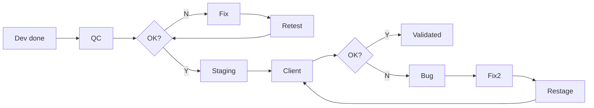

# Engagements : Venues

> Delivery process, acceptance criteria, and reciprocal commitments.

### 1. Code Quality Rules

| Rule | Detail |
|-----------|--------|
| Code review | Required before merge to dev branch |
| Linting | ESLint (@typescript-eslint for backend, eslint-config-next for frontend) |
| Formatting | Prettier |
| Type safety | TypeScript strict mode (frontend/admin) |
| API validation | class-validator + class-transformer (backend), Zod/Yup (frontend) |
| Security headers | Helmet on all API responses |
| Rate limiting | Auth endpoints : 10 requests/hour |

### 2. Delivery Process

| Aspect | Commitment |
|--------|-----------|
| Sprint duration | 2 weeks |
| Demo frequency | End of each sprint (Friday) |
| Staging updates | After QC validation (1 sprint behind dev) |
| Changelog | Updated with each staging deployment |
| Documentation | Maintained in centralized docs repository |
| Cancellation notice | 48 hours minimum for any meeting change |

### 3. Acceptance Testing Process

5-step process:

1. **Development complete** : Feature passes internal code review and is merged to dev
2. **QC validation** : Internal QC team tests on dev environment, reports bugs in Jira
3. **QC/Dev loop** : Developers fix QC-reported bugs, QC re-validates (max 2 iterations per story)
4. **Staging deployment** : QC-validated features deployed to staging
5. **Client acceptance** : Client tests on staging, provides feedback via shared spreadsheet or Jira

Acceptance process flow:

### 4. Anomaly Classification

| Category | Definition | Response time | Resolution time |
|----------|-----------|---------------|-----------------|
| Blocker (P0) | Platform unusable, core flow broken | Same day | Next working day |
| Major (P1) | Feature broken, workaround exists | Next working day | Within current sprint |
| Minor (P2) | Visual issue, non-blocking bug | Next sprint | Within 2 sprints |
| Enhancement | Improvement suggestion, not a bug | Backlog | Prioritized in planning |

> Response and resolution times are internal targets, not contractual SLAs.

### 5. Exit Criteria (Release)

| Criteria | Requirement |
|----------|-----------|
| Stories | 100% of P0 stories done, 90%+ of P1 stories done |
| Blocker bugs | 0 open P0 bugs |
| Major bugs | < 5 open P1 bugs (with workarounds documented) |
| Performance | No blocking performance regressions on core flows |
| Security | No known critical vulnerabilities |
| Browser support | Level A browsers pass full regression |
| Payment flow | Stripe checkout works end-to-end |
| i18n | FR and EN complete |
| Client sign-off | Written acceptance of the full contracted scope |

### 6. Post-Launch Support

Post-launch support covers the transition period immediately following go-live. It is limited to bug fixes on the delivered scope; new features require a change request.

| Aspect | Detail |
|--------|-----------|
| Support window | Starts at go-live and runs for the contractually agreed warranty period |
| Bug fixes | P0/P1 bugs on delivered scope |
| Communication | Slack channel + weekly sync |
| Monitoring | Application logs + error alerts |
| Incident response | Slack notification, acknowledgment during business hours |

### 7. Client Commitments (Reciprocal)

| Commitment | Expected |
|-----------|----------|
| Sprint review attendance | Client representative at each end-of-sprint demo |
| Feedback response time | < 5 business days after staging deployment |
| Content delivery | Client-provided content (images, copy, translations) delivered per sprint schedule |
| Design changes | Communicated via PM or Figma comments on DU version, not direct Figma edits |
| Acceptance testing | Completed within 5 business days of staging update |
| CR process | Change requests submitted via agreed tracking spreadsheet |
| Meeting preparation | Agenda items submitted 24h before scheduled meetings |

### 8. Governance

| Aspect | Details |
|--------|---------|
| Project Manager | Arthus Chambon (day-to-day) |
| Technical Supervisor | Paul de Renty (architecture, review) |
| Client PO | Charlotte Goncalves Vaz |
| Escalation path | PM, then Tech Supervisor, then Management |
| Decision authority | Scope changes require written approval from both parties |
| Tracking tools | Jira (VEN board: site, VA board: admin), GitLab, Slack |

### 9. Intellectual Property and Data

| Aspect | Terms |
|--------|-------|
| Source code | Full ownership transfers to client upon final delivery and acceptance |
| Reusable frameworks | DU retains rights to reuse internal libraries, tooling, and generic components developed independently of the project |
| Client data | All data (user accounts, venues, quotes, media) belongs exclusively to the client |
| Data portability | Database exports provided in standard formats upon request |
| Confidentiality | Both parties bound by NDA covering project details, business logic, and technical architecture |
