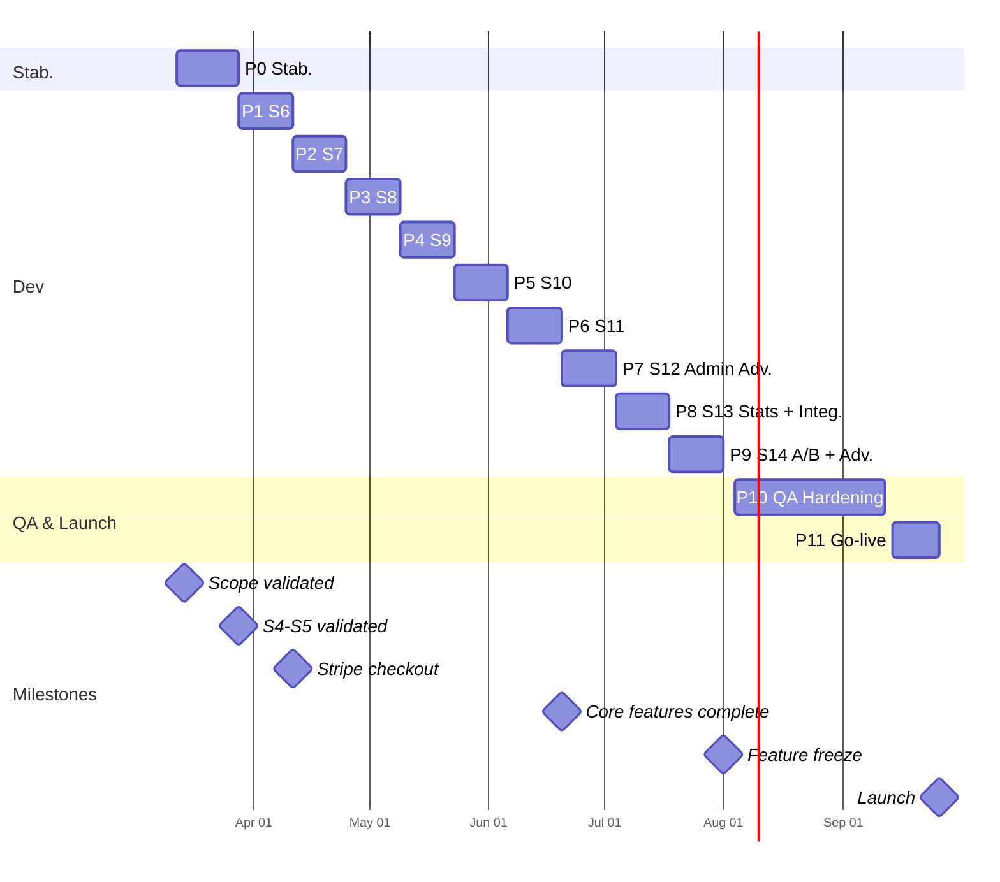
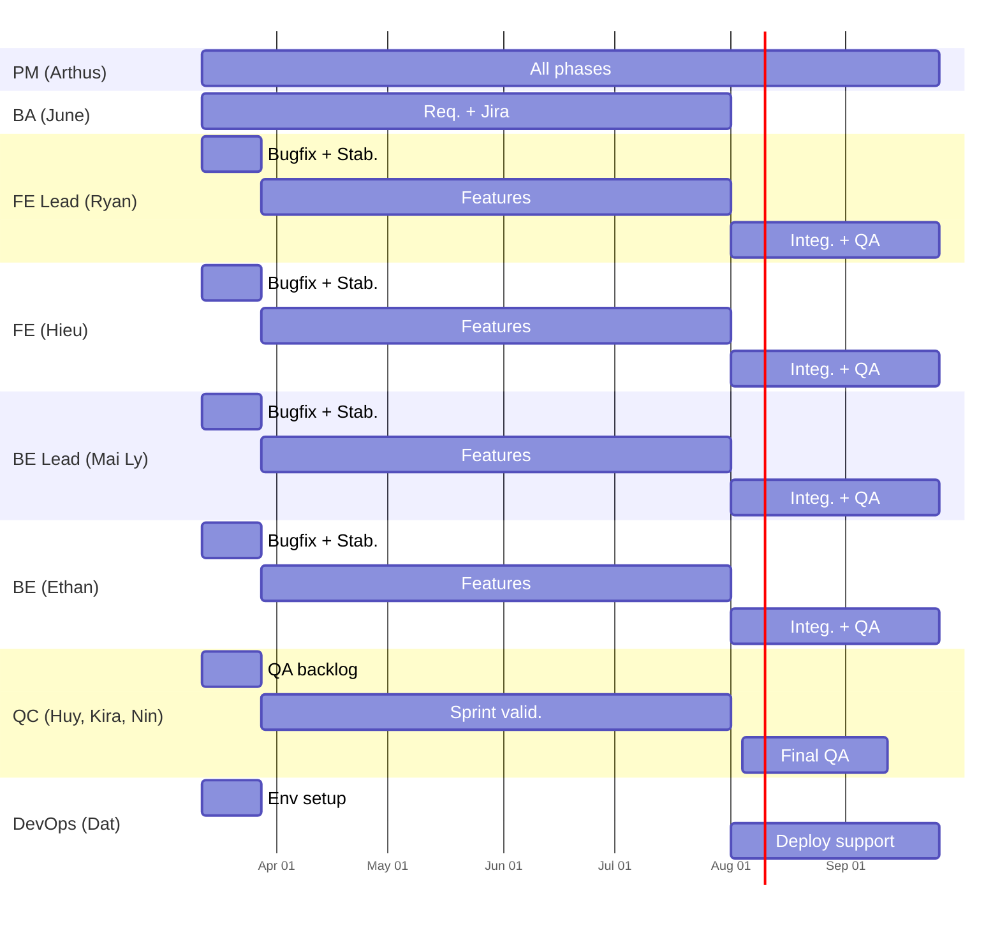

# Phasing and Planning: Venues

> Full engagement timeline : unified V1 delivery of 371 JH over ~7 months (March 2026 to end of September 2026). The plan runs from a stabilization phase (P0, S4-S5 QC) through sprint-based development (S6-S14) to QA hardening and go-live. **Hard constraint : V1 delivery by end of September 2026.** If velocity slips, scope is reduced via the overflow rule (lowest-priority items deferred), not the timeline.

## 1. Current state (as of 2026-03-13)

The project has completed sprints 1 through 3. Sprints 4 and 5 are in QC validation (not yet client-validated), and Sprint 6 is early in development. This represents approximately 50% of dev effort invested on the scope developed up to that point (~160 JH), with only ~30% client-visible (sprints 1-3 validated on staging).

### Sprint status (from Jira, March 2026)

| Sprint | Board | Total | Done | In QC / Dev | To Do | Status |
|---|---|---|---|---|---|---|
| S1-S3 | VEN | all | all | - | - | Validated |
| S1-S3 | VA | 37 | 36 | 1 (RBAC) | - | Nearly complete |
| S4 | VEN | 50 | ~34 | ~8 in QA | ~8 | In QC |
| S4 | VA | 34 | - | 19 on dev/testing | 15 | In QC (P0 priority) |
| S5 | VEN | 8 | 6 | 1 | 1 | In QC |
| S5 | VA | 17 | - | 14 on dev | 3 | In QC |
| S6 | VEN | 5 | 2 | 2 (Chat) | 1 (Subscription) | In progress |
| S6 | VA | ~17 | - | ~3 | ~14 | In progress |

**P0 focus** : admin panel validation (VA S4-S5) is the priority for the stabilization phase. Sprint 6 features (Chat, Subscription/Stripe) continue in parallel.

### Effort summary

| Metric | Value |
|---|---|
| Total estimated effort | ~371 JH (M1-M14 core + M15 Admin Advanced) |
| Developed and validated (S1-S3) | ~100 JH |
| Developed, in QC (S4-S5) | ~60 JH |
| In progress (S6, early) | ~15 JH |
| Remaining new feature work (M1-M14) | ~144 JH |
| M15 (Admin Advanced) feature work | ~52 JH |
| QA/bugfix pipeline (parallel, larger than initial estimate) | ~70 JH |
| Integration and cross-cutting work | ~30 JH |
| **Total remaining to go-live** | **~296 JH** |

**Capacity model** : with 3.8 effective FTE (4 devs, Mai Ly at 0.8), the team produces ~13.6 MD/week. Under the 50% parallel QA model (decision D-04), ~6.8 MD/week goes to new features and ~6.8 MD/week goes to bug fixes. Both tracks contribute directly to delivery.

**Timeline** : 296 JH / 13.6 MD per week = ~21.8 weeks. Counting from P0 start (Mar 12) with the full team contributing to the unified scope, the plan lands by end of September 2026 within the hard cap.

### Sprint 6 re-integration

Sprint 6 was paused (decision D-02) with incomplete work. These items are absorbed into the existing phase plan, not added on top :

| S6 item | Status | Absorbed into | Notes |
|---|---|---|---|
| VEN-49 Subscription | To do | P1 (Stripe sprint) | Already planned as F7.1-F7.4 |
| VEN-47 Chat (Partner) | In progress | P2 (Messaging polish) | Already planned as F6.1 |
| VEN-39 Chat (Client) | In progress | P2 (Messaging polish) | Already planned as F6.1 |
| VA S6 items (~14 to do) | Mostly to do | P3-P5 or later sprints | Admin items sequenced across sprints per priority |

S6 re-integration does not add scope : these features were already counted in the WBS. P1-P2 start from partially-complete S6 code rather than from scratch.

### Overflow rule

If at any sprint gate the team is behind schedule, the following items are deferred to later sprints within the same engagement (in priority order) :
1. Lowest-priority M15 items (Admin Advanced)
2. P2 features (F9 Favorites, F10.3 Ethical commitments)
3. Non-critical admin stories in P4
4. Remaining polish stories

**The timeline is fixed at end of September 2026. Scope flexes within the engagement.**

> Note: several M15 stories (including backup UI and maintenance mode) already have code deployed to dev but not QC-validated. Their effective effort will be lower than WBS estimates since implementation exists.

## 2. Overview

### Venues : Full Engagement

## 3. Phase summary

| Phase | Dates | Objective | Key deliverables | Exit gate |
|---|---|---|---|---|
| P0: Stabilization | Mar 12 : Mar 28 | Clear QA backlog, validate sprints 4-5 | Bug fixes, staging update, client validation of S3-S5 | Sprints 3-5 accepted by client |
| P1: Sprint 6 | Mar 28 : Apr 11 | Subscriptions + Stripe | F7.1-F7.4 (Stripe checkout, plans, pioneer), Admin F12.4 | Payment flow functional on dev |
| P2: Sprint 7 | Apr 11 : Apr 25 | Visits + Video + Reviews | F5.1-F5.3, F8.1-F8.3, F6.1 messaging polish | Visit booking and review flow complete |
| P3: Sprint 8 | Apr 25 : May 9 | Search refinement + Groups | F2.2-F2.4, F10.1-F10.3, F3.4 homepage | Advanced search and group pages live |
| P4: Sprint 9 | May 9 : May 23 | Content + Admin core | F11.1-F11.4, F12.1-F12.6, F14.1-F14.3 | Blog, FAQ, admin dashboard functional |
| P5: Sprint 10 | May 23 : Jun 6 | Polish + i18n + Remaining core | F13.1-F13.2, F9.1-F9.2, remaining M1-M14 stories | All M1-M14 features complete on dev |
| P6: Sprint 11 | Jun 6 : Jun 20 | Core integration + Bug fixes | Cross-module testing, integration bugs, performance | Core feature freeze, dev stable |
| P7: Sprint 12 | Jun 20 : Jul 4 | M15 admin advanced : subscription mgmt, notifications, moderation, maintenance | F15.3, F15.4, F15.5, F15.7, US-161 to US-168, US-174 | Admin Advanced P1 features on dev |
| P8: Sprint 13 | Jul 4 : Jul 18 | M15 admin advanced : statistics + integrations | F15.1 (analytics), F15.6 (ODOO, Brevo), US-155 to US-158, US-170, US-172 | Dashboards and integrations on dev |
| P9: Sprint 14 | Jul 18 : Aug 1 | M15 admin advanced : A/B + Advanced | F15.2 (A/B), F15.7 (backup UI), F15.8 (translation, media, reports), US-159 to US-160, US-173, US-175 to US-178 | All M15 features on dev |
| P10: Final QA | Aug 4 : Sep 12 | Full regression + Client acceptance | Regression suite, acceptance testing, bug fix loops | Zero P0, fewer than 5 P1 bugs, client sign-off |
| P11: Go-live | Sep 14 : Sep 26 | Production deployment | Production setup, monitoring, DNS, go-live checklist | Platform live, monitoring active |

## 4. Phase details

### P0: Stabilization (Mar 12 : Mar 28)

| Attribute | Value |
|---|---|
| Period | March 12 : March 28, 2026 (2.5 weeks) |
| Objective | Clear the QA backlog for sprints 4-5 and get them validated on staging |

**Scope** :
- VEN Sprint 4 : ~8 issues in QA, ~8 remaining
- VA Sprint 4 : 34 issues (16 deployed to dev, 18 remaining)
- VA Sprint 3 : 1 remaining item (RBAC)
- Sprint 6 : paused for stabilization (decision D-02), resumes after P0

**Deliverables**:
- [ ] Process client feedback (categorize, prioritize, fix)
- [ ] Fix P0/P1 bugs from sprints 3-5
- [ ] Complete VA Sprint 4 QA validation (priority on items deployed to dev)
- [ ] Deploy validated fixes to staging
- [ ] Client validates sprints 4-5 on staging
- [ ] Finalize unified scope document with client
- [ ] Set up documentation hub

**Note** : if admin QA validation extends beyond P0, it continues in parallel with Sprint 6 feature work.

**Dev allocation**:

| Developer | Focus |
|---|---|
| Ryan (FE) | Frontend bug fixes, staging preparation |
| Hieu (FE) | Admin bug fixes (VA Sprint 4 backlog priority) |
| Ethan (BE) | API bug fixes, data seeding |
| Mai Ly (BE) | Backend bug fixes, env management |

**Exit gate**: Sprints 4-5 accepted by client on staging, unified scope signed off

### P1: Sprint 6 (Mar 28 : Apr 11)

| Attribute | Value |
|---|---|
| Period | March 28 : April 11, 2026 |
| Objective | Implement subscription and payment system (Stripe) |

**Modules**: Subscriptions (F7), Admin Subscriptions (F12.4)

**Stories**: US-075 to US-084

**Deliverables**:
- [ ] Stripe checkout flow (F7.1)
- [ ] Subscription plans management (F7.2)
- [ ] Pioneer pricing logic (F7.3)
- [ ] Admin subscription dashboard (F12.4)

**Dev allocation**:

| Developer | Focus |
|---|---|
| Ryan (FE) | Subscription UI, checkout flow |
| Hieu (FE) | Admin subscription management |
| Ethan (BE) | Stripe API integration, webhooks |
| Mai Ly (BE) | Subscription models, billing logic |

QA parallel: 2 devs rotate on S4-S5 bug fixes

> Stripe integration spans P1-P2: core checkout flow in P1, subscription management polish in P2.

**Exit gate**: Payment flow functional end-to-end on dev

### P2: Sprint 7 (Apr 11 : Apr 25)

| Attribute | Value |
|---|---|
| Period | April 11 : April 25, 2026 |
| Objective | Complete visits, video calls, and reviews |

**Modules**: Visits (F5), Reviews (F8), Messaging polish (F6.1)

**Stories**: US-061 to US-068 (Visits), US-085 to US-092 (Reviews)

**Deliverables**:
- [ ] Visit scheduling UI and APIs (F5.1-F5.3)
- [ ] Video call integration (F5.3)
- [ ] Review submission and partner replies (F8.1-F8.3)
- [ ] Messaging polish and notifications (F6.1)

**Dev allocation**:

| Developer | Focus |
|---|---|
| Ryan (FE) | Visit scheduling UI, video call UI |
| Hieu (FE) | Review components, partner replies |
| Ethan (BE) | Twilio integration, visit APIs |
| Mai Ly (BE) | Review APIs, notification triggers |

**Exit gate**: Visit booking and review flow complete on dev

### P3: Sprint 8 (Apr 25 : May 9)

| Attribute | Value |
|---|---|
| Period | April 25 : May 9, 2026 |
| Objective | Refine search, build groups and partner pages |

**Modules**: Search (F2), Groups/Partners (F10), Homepage (F3.4)

**Stories**: US-020 to US-028 (Search), US-099 to US-108 (Groups/Partners)

**Deliverables**:
- [ ] Advanced search filters (F2.2-F2.4)
- [ ] Group listing and detail pages (F10.1-F10.3)
- [ ] Homepage redesign (F3.4)

**Exit gate**: Advanced search and group pages live on dev

### P4: Sprint 9 (May 9 : May 23)

| Attribute | Value |
|---|---|
| Period | May 9 : May 23, 2026 |
| Objective | Content pages and core admin features |

**Modules**: Content (F11), Admin core (F12), Static pages (F14)

**Stories**: US-109 to US-120 (Content), US-121 to US-142 (Admin core)

**Deliverables**:
- [ ] Blog system (F11.1-F11.4)
- [ ] FAQ pages (F14.1-F14.3)
- [ ] Admin dashboard core (F12.1-F12.6)

**Exit gate**: Blog, FAQ, admin dashboard functional on dev

### P5: Sprint 10 (May 23 : Jun 6)

| Attribute | Value |
|---|---|
| Period | May 23 : June 6, 2026 |
| Objective | i18n completion, favorites, remaining core polish |

**Modules**: Favorites (F9), i18n + Layout (F13)

**Stories**: US-093 to US-098 (Favorites), US-143 to US-154 (i18n + Layout)

**Deliverables**:
- [ ] Favorites system (F9.1-F9.2)
- [ ] i18n completion (F13.1-F13.2)
- [ ] Remaining M1-M14 polish stories

**Exit gate**: All M1-M14 features complete on dev

### P6: Sprint 11 (Jun 6 : Jun 20)

| Attribute | Value |
|---|---|
| Period | June 6 : June 20, 2026 |
| Objective | Core integration testing, cross-module bugs, performance optimization |

No new M1-M14 features. Focus: integration, regression, performance before M15 sprints begin.

**Deliverables**:
- [ ] Cross-module integration testing
- [ ] Integration bug fixes
- [ ] Performance optimization
- [ ] Staging fully up to date

**Exit gate**: Core feature freeze, dev stable, all M1-M14 features on staging

### P7: Sprint 12 (Jun 20 : Jul 4)

| Attribute | Value |
|---|---|
| Period | June 20 : July 4, 2026 |
| Objective | Admin Advanced : subscription management, notifications, moderation, maintenance |

**Modules**: M15 features F15.3 (advanced subscription), F15.4 (notification system), F15.5 (content moderation), F15.7 (maintenance mode)

**Stories**: US-161 to US-168, US-174

**Exit gate**: Admin Advanced P1 features on dev

### P8: Sprint 13 (Jul 4 : Jul 18)

| Attribute | Value |
|---|---|
| Period | July 4 : July 18, 2026 |
| Objective | Admin Advanced : statistics and integrations |

**Modules**: M15 features F15.1 (analytics dashboards), F15.6 (ODOO, Brevo campaigns)

**Stories**: US-155 to US-158, US-170, US-172

**Exit gate**: Dashboards and integrations on dev

### P9: Sprint 14 (Jul 18 : Aug 1)

| Attribute | Value |
|---|---|
| Period | July 18 : August 1, 2026 |
| Objective | Admin Advanced : A/B testing + remaining advanced features |

**Modules**: M15 features F15.2 (A/B testing), F15.7 (backup UI), F15.8 (translation mgmt, media buying, donations, report export)

**Stories**: US-159 to US-160, US-173, US-175 to US-178

**Exit gate**: All M15 features on dev, full scope code-complete

### P10: Final QA (Aug 4 : Sep 12)

| Attribute | Value |
|---|---|
| Period | August 4 : September 12, 2026 |
| Objective | Full regression testing and client acceptance |

**Deliverables**:
- [ ] Full regression test suite executed
- [ ] Client acceptance testing on staging
- [ ] Bug fix sprints (P0 and P1 only)
- [ ] Performance testing
- [ ] Security audit

**Exit gate**: Zero P0 bugs, fewer than 5 P1 bugs, client sign-off

### P11: Go-live (Sep 14 : Sep 26)

| Attribute | Value |
|---|---|
| Period | September 14 : September 26, 2026 |
| Objective | Production deployment and launch |

**Deliverables**:
- [ ] Production environment setup
- [ ] DNS configuration
- [ ] Monitoring and alerting
- [ ] Data migration (if needed)
- [ ] Go-live checklist execution
- [ ] Post-launch monitoring (48h)

**Exit gate**: Platform live, monitoring active, no critical issues

## 5. Team and allocation

### Current team (from contract, names updated from GitLab)

| Role | Profile | Name | FTE | Repos (GitLab) | Scope |
|---|---|---|---|---|---|
| Technical Supervisor | Tech Lead / Architect | Paul de Renty | Oversight | Review, architecture | All phases |
| Project Manager | PM | Arthus Chambon | 1.0 | Jira, client | All phases |
| Business Analyst | BA | June (Thao Hoang) | 0.2 | Jira, specs | P0-P9 |
| Frontend Lead | Senior FE Dev | Quoc Le (Ryan) | 1.0 | front, admin, strapi | All phases |
| Frontend Developer | FE Dev | Nguyen Hieu (Hieu) | 1.0 | front, admin | All phases |
| Backend Lead | Senior BE Dev | Mai Ly (William) | 0.8 | back, strapi | All phases |
| Backend Developer | BE Dev | Hoang Tran (Ethan) | 1.0 | back | All phases |
| QC Lead | QA Engineer | Huy Nguyen (Silencer) | 1.0 | Jira | All phases |
| QC Tester | QA Tester | Nhung Nguyen (Kira) | 0.5 | Jira | P0-P10 |
| QC Tester | QA Tester | Nin | 1.0 | Jira | P0-P10 |
| DevOps (shared) | Infrastructure | Dat Tran | 0.25 | CI/CD, infra | P0, P10-P11 |

**Effective dev capacity** : 3.8 FTE (Ryan 1.0 + Hieu 1.0 + Mai Ly 0.8 + Ethan 1.0)

### Team Allocation

## 6. Sprint ceremonies

| Ceremony | Frequency | Participants | Duration |
|---|---|---|---|
| Sprint Planning | Bi-weekly (Mon) | PM, BA, Dev leads | 1h |
| Daily Standup | Daily | Dev team, PM | 15min |
| Sprint Review/Demo | Bi-weekly (Fri) | PM, Dev leads, Client | 1h |
| Sprint Retrospective | Bi-weekly (Fri) | Dev team, PM | 30min |
| Client Workshop | End of sprint | PM, Tech Lead, Client | 1-2h |
| QC Sync | Weekly | QC team, PM | 30min |

## 7. Milestones and gates

| Date | Milestone | Validation criteria |
|---|---|---|
| 2026-03-14 | Unified scope validated | Client signs off on consolidated scope |
| 2026-03-28 | QA backlog cleared | Sprints 4-5 accepted on staging (VA S4 backlog cleared) |
| 2026-04-11 | Stripe core checkout | Payment flow works end-to-end (subscription polish continues in P2) |
| 2026-05-09 | Core features complete | Search, Quotes, Visits, Messaging, Subscriptions all on staging |
| 2026-06-06 | All M1-M14 features on dev | Core scope complete |
| 2026-06-20 | Core feature freeze | Entering Admin Advanced sprints |
| 2026-08-01 | Feature freeze | All M15 features on dev, code complete |
| 2026-09-12 | QA sign-off | Zero P0, fewer than 5 P1 bugs, client acceptance |
| 2026-09-26 | Production launch | Platform live, monitoring active. Hard cap |

## 8. Methodology

| Aspect | Choice |
|---|---|
| Framework | Scrum (adapted) |
| Sprint duration | 2 weeks |
| Tools | Jira (VEN + VA boards), GitLab, Slack |
| Staging policy | Always 1 sprint behind dev, QC-validated only |
| QA model | Parallel: 2 devs on bug fixes + 2 devs on features |
| Documentation | Centralized docs repository (source of truth) |

## 9. Planning risks

| Risk | Impact | Mitigation |
|---|---|---|
| Payment integration complexity (Stripe spans P1-P2) | Delays subscription revenue | Core checkout in P1, subscription management in P2. Stripe test mode from P0 |
| Client availability for sprint validation | Sprint gates delayed | Validation sessions scheduled 1 week in advance, structured demo agendas |
| Staging environment stability | QA and validation blocked | DevOps hardening in P0, staging always 1 sprint behind dev |
| Feedback volume during stabilization | P0 extends into P1 | Strict triage : P0/P1 fixes only, lower-priority items deferred to later sprints |
| Velocity variance | Feature freeze shifted | Overflow rule : defer lowest-priority items within the engagement |
| Third-party integration dependencies (Twilio, Stripe, ODOO) | Feature completion blocked | Early POCs during P0, fallback approaches documented |
