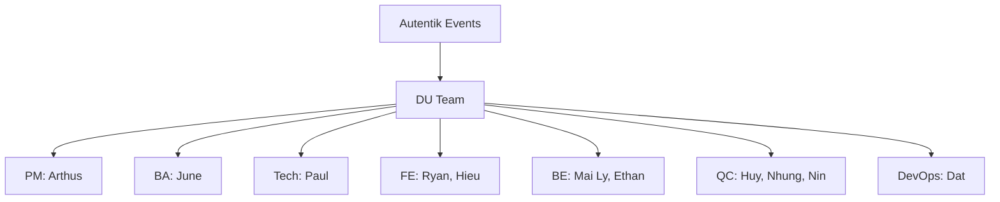

# Client Profile : Venues

## Identity card

| Item | Detail |
|---|---|
| Legal name | Autentik Events SAS |
| Legal form | Simplified joint-stock company (Société par Actions Simplifiée) |
| Industry | Events and travel management |
| Location | Paris, France |
| Website (Events) | www.autentik-events.com |
| Website (Travel) | www.seminaire-international.com |
| Main contact | Charlotte Goncalves Vaz, Events and Travel Manager |
| Secondary contact | Léa Simon, Chef de Projet MICE |
| Effectif | ~10 employees (events + travel divisions) |
| Associated brands | Séminaire International, Autentik Events, Anim'Finder |

## Activity and positioning

Autentik Events is a French B2B events and business travel agency operating in the MICE sector (Meetings, Incentives, Conferences, Exhibitions). They organize corporate seminars, conferences, incentive travel, and team-building events. "Venues" is a B2B marketplace for professional event space booking : venue owners (partners) list their spaces, and event organizers (clients) search, compare, and request quotes via an RFQ workflow. Target venues include hotels, conference centers, restaurants, and atypical spaces across France.

## Organization and governance

## Stakeholders

| Role | Name / Function | Project responsibility |
|---|---|---|
| Product Owner | Charlotte Goncalves Vaz | Vision, validation, acceptance |
| Client Coordinator | Léa Simon (Chef de Projet MICE) | Sprint feedback, testing, CR tracking |
| Technical Supervisor | Paul de Renty | Architecture, code review, scoping |
| Project Manager | Arthus Chambon | Sprint planning, client communication, demos |
| Business Analyst | June (Thao Hoang) | Requirements, feedback categorization, Jira |
| Frontend Lead | Ryan (Quoc Le) | Next.js frontend, staging preparation |
| Frontend + Admin Developer | Hieu (Nguyen Hieu) | Frontend and admin development, bug fixes |
| Backend Lead | Mai Ly (William) | NestJS backend, DB, deployment coordination |
| Backend Developer | Ethan (Hoang Tran) | APIs, integrations, data seeding |
| QC Lead | Huy Nguyen (Silencer) | Test planning, smoke tests, Jira verification |
| QC Tester | Nhung Nguyen (Kira) | Bug verification, regression testing |
| QC Tester | Nin | Bug reporting, ticket verification |
| DevOps | Dat Tran | CI/CD, environments, S3, monitoring (shared) |

## Context and challenges

1. **B2B marketplace launch** : Autentik Events is building a B2B venue marketplace for the MICE sector, connecting event organizers with venue owners through an RFQ workflow. The unified scope covers all features required for a full commercial launch.

2. **Contract and timeline** : contract signed July 28, 2025. Timeline adjusted following scope refinement in March 2026; the engagement now targets a single consolidated delivery at the end of September 2026.

3. **Scope** : three user types (clients, partners, admin). Delivered scope includes venue search, multi-venue quoting, visit scheduling (in-person and video), subscription management, messaging, reviews, blog (Le Mag), back-office, and the full Admin Advanced module (statistics, A/B testing, ODOO, advanced notifications, moderation, backup, maintenance).

## Existing systems and constraints

- **Design tooling**: Figma for UI designs (client version and DU version exist separately, sync issues identified between the two)
- **Client feedback**: tracked via shared Google Sheet (approximately 200 items accumulated)
- **Scheduling**: client uses Calendly for scheduling (free plan, limitations for team booking)
- **Email/Newsletter**: Brevo integration for newsletter and email automation
- **Registration**: SIRET-based company registration (French business registry) for partner onboarding
- **Multi-language**: French and English minimum, full i18n required
- **Regulatory**: RGPD compliance, CGU/CGV legal pages, data deletion request workflow
- **Technical stack**: Next.js (frontend), NestJS (backend), PostgreSQL (primary database), S3 for assets, Strapi CMS for Le Mag, Twilio for video visits, Stripe for payments, Elasticsearch for search
